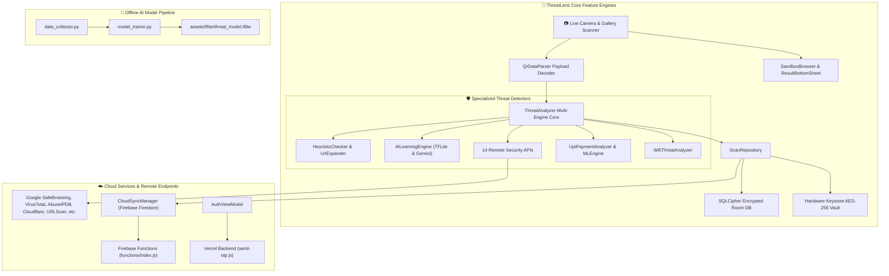
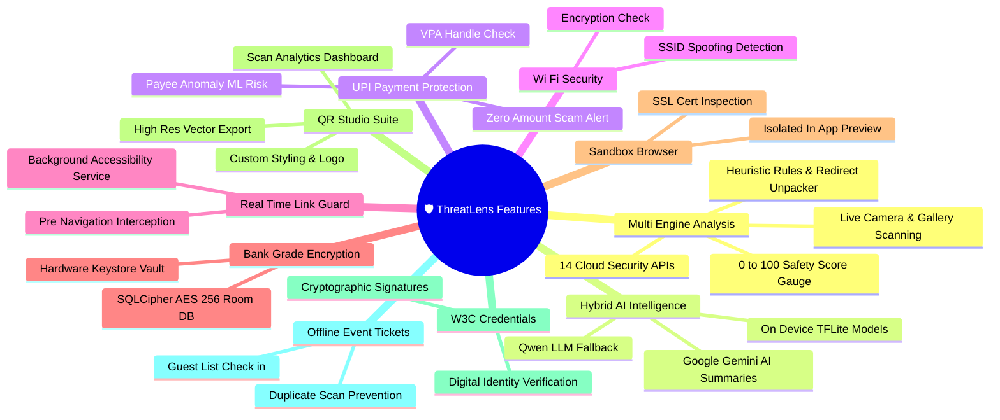

# 🛡️ ThreatLens — Feature Architecture & Implementation Guide

A comprehensive, feature-first reference for **ThreatLens** — an AI-powered QR & Web Security Intelligence platform for Android. This document is organized by **what the app does**, detailing main features, sub-features, how they are achieved, what benefits they deliver, and which source files power them.

---

## 🗺️ System Architecture Diagram



---

## 📑 Table of Contents

1. [🔍 Multi-Engine QR Code Threat Analysis](#1--multi-engine-qr-code-threat-analysis)
2. [🤖 On-Device & Cloud AI Intelligence](#2--on-device--cloud-ai-intelligence)
3. [💰 UPI Payment Fraud Protection](#3--upi-payment-fraud-protection)
4. [📶 Wi-Fi Network Security Analysis](#4--wi-fi-network-security-analysis)
5. [🛡️ Real-Time Link Guard (Background Protection)](#5-️-real-time-link-guard-background-protection)
6. [🔐 Bank-Grade Encrypted Data Storage](#6--bank-grade-encrypted-data-storage)
7. [🧪 Sandbox Browser (Isolated Web Preview)](#7--sandbox-browser-isolated-web-preview)
8. [📜 Scan History, Search & PDF Export](#8--scan-history-search--pdf-export)
9. [🎨 QR Studio (Design, Analytics & Export)](#9--qr-studio-design-analytics--export)
10. [🔒 Encrypted QR Codes & Secure Vault](#10--encrypted-qr-codes--secure-vault)
11. [🪪 W3C Verifiable Credentials & Digital Identity](#11--w3c-verifiable-credentials--digital-identity)
12. [🎟️ Event Ticket Management & Offline Check-in](#12-️-event-ticket-management--offline-check-in)
13. [🔑 User Authentication & Cross-Device Sync](#13--user-authentication--cross-device-sync)
14. [👥 Community Threat Intelligence & Crowd Reporting](#14--community-threat-intelligence--crowd-reporting)
15. [🧠 Neural Core Dashboard & Federated Learning](#15--neural-core-dashboard--federated-learning)
16. [⚡ Quick Settings Tile & Instant Access](#16--quick-settings-tile--instant-access)
17. [📊 Weekly Security Digest Notifications](#17--weekly-security-digest-notifications)
18. [🌐 Web Landing Page & Privacy Portal](#18--web-landing-page--privacy-portal)
19. [🚀 CI/CD Automated Build & Testing](#19--cicd-automated-build--testing)
20. [🤖 Offline AI Model Training Pipeline](#20--offline-ai-model-training-pipeline)
21. [🗺️ Interactive Tree Map & Mindmap Visualization Instructions](#21-️-interactive-tree-map--mindmap-visualization-instructions)

---

## 1. 🔍 Multi-Engine QR Code Threat Analysis

> The flagship capability of ThreatLens. Every scanned QR code is simultaneously evaluated by 14 cloud security APIs, local heuristic rules, and on-device AI models to produce a unified **0–100 Safety Score**.

### 1.1 QR Code Scanning & Payload Recognition

| Sub-Feature | How It's Achieved | Benefit |
| :--- | :--- | :--- |
| **Live Camera QR Scanning** | CameraX API streams camera frames to Google ML Kit Barcode Scanning in real time. | Instant, zero-delay QR detection — no shutter button needed. |
| **Gallery Image Import** | Android `ActivityResultContracts.GetContent` picks images, ML Kit decodes them offline. | Users can scan QR codes from screenshots, forwarded images, or saved photos. |
| **Universal Payload Parsing** | Raw barcode strings are parsed into structured types: URL, UPI, Wi-Fi, vCard, Encrypted, Credential, or Plain Text. | Each payload type triggers the correct specialized analyzer instead of a generic check. |

**📁 Files:**
- [`ScannerScreen.kt`](file:///c:/AndroidProjects/ThreatLens_FINAL_v2/ThreatLens/app/src/main/java/com/safeqr/scanner/ui/screens/ScannerScreen.kt) — Camera UI, torch toggle, pinch zoom, image picker
- [`ScanOverlay.kt`](file:///c:/AndroidProjects/ThreatLens_FINAL_v2/ThreatLens/app/src/main/java/com/safeqr/scanner/ui/components/ScanOverlay.kt) — Animated viewfinder reticle and corner brackets
- [`QrDataParser.kt`](file:///c:/AndroidProjects/ThreatLens_FINAL_v2/ThreatLens/app/src/main/java/com/safeqr/scanner/analysis/QrDataParser.kt) — Universal payload decoder
- [`ScannerViewModel.kt`](file:///c:/AndroidProjects/ThreatLens_FINAL_v2/ThreatLens/app/src/main/java/com/safeqr/scanner/viewmodel/ScannerViewModel.kt) — Scanning state, debouncing, analysis orchestration

---

### 1.2 Multi-Engine Threat Scoring (14 Cloud APIs + Local Rules)

| Sub-Feature | How It's Achieved | Benefit |
| :--- | :--- | :--- |
| **Google Safe Browsing Check** | Queries Google's Safe Browsing v4 API for malware, social engineering, and unwanted software flags. | Leverages Google's real-time global threat database used by Chrome. |
| **VirusTotal Multi-AV Scan** | Queries 70+ antivirus scanners and domain blocklists through the VirusTotal API. | No single antivirus catches everything — 70+ engines give near-complete coverage. |
| **AbuseIPDB IP Reputation** | Resolves destination server IP and checks its abuse confidence score and attack history. | Detects malicious hosting infrastructure even when domain names look clean. |
| **Cloudflare Radar Domain Intel** | Fetches global domain popularity rank and DNS security annotations. | Flags obscure, low-traffic domains that are statistically more likely to be phishing. |
| **URLScan.io Page Scan** | Triggers automated web page rendering, DOM inspection, and outgoing connection analysis. | Detects hidden redirects, JavaScript-based phishing kits, and drive-by downloads. |
| **PhishTank Phishing Database** | Cross-references URLs against community-verified active phishing campaigns. | Catches active spoofed banking and login portals verified by human analysts. |
| **abuse.ch URLhaus Malware DB** | Checks domains against live malware distribution endpoint feeds. | Blocks URLs actively spreading ransomware, trojans, and botnets. |
| **WhoisXML Domain Age Check** | Inspects domain registration date and registrant identity. | Newly registered domains (< 7 days old) are a key indicator of disposable phishing sites. |
| **Qualys SSL Labs Grade** | Evaluates SSL/TLS certificate chain, cipher strength, and vulnerability status. | Catches self-signed certs, expired certificates, and Heartbleed/POODLE vulnerabilities. |
| **Have I Been Pwned (HIBP)** | Checks scanned email addresses against historical data breach databases using k-Anonymity. | Alerts users if their account credentials have been exposed in known breaches. |
| **IP Geolocation & ISP Lookup** | Retrieves server country, hosting ISP, and ASN details. | Reveals if a "local bank" link is actually hosted in a different country. |
| **Heuristic Pattern Rules** | Regex-based detection of typosquatting (`g00gle.com`), raw IP hostnames, suspicious TLDs (`.zip`, `.top`), excessive subdomains, and brand impersonation keywords. | Catches threats instantly with zero latency — no network call required. |
| **URL Redirect Unpacking** | Recursively follows HTTP 301/302 redirect chains to reveal the final destination behind shortlinks (`bit.ly`, `tinyurl.com`, `t.co`). | Prevents attackers from hiding malicious destinations behind legitimate-looking shorteners. |
| **Domain & Content Categorization** | Analyzes web page structure, meta tags, and SSL certs using JSoup to classify websites into categories (Banking, E-Commerce, Gambling, Phishing, Malware). | Gives users context about what type of site they're about to visit. |

**📁 Files:**
- [`ThreatAnalyzer.kt`](file:///c:/AndroidProjects/ThreatLens_FINAL_v2/ThreatLens/app/src/main/java/com/safeqr/scanner/analysis/ThreatAnalyzer.kt) — Central orchestrator synthesizing all 14 engines into one safety score
- [`HeuristicChecker.kt`](file:///c:/AndroidProjects/ThreatLens_FINAL_v2/ThreatLens/app/src/main/java/com/safeqr/scanner/analysis/HeuristicChecker.kt) — Zero-latency regex rule engine
- [`UrlExpander.kt`](file:///c:/AndroidProjects/ThreatLens_FINAL_v2/ThreatLens/app/src/main/java/com/safeqr/scanner/analysis/UrlExpander.kt) — Redirect chain resolver
- [`WebsiteCategorizer.kt`](file:///c:/AndroidProjects/ThreatLens_FINAL_v2/ThreatLens/app/src/main/java/com/safeqr/scanner/analysis/WebsiteCategorizer.kt) — JSoup-based domain classifier
- [`WebshrinkerClient.kt`](file:///c:/AndroidProjects/ThreatLens_FINAL_v2/ThreatLens/app/src/main/java/com/safeqr/scanner/analysis/WebshrinkerClient.kt) — Webshrinker domain intelligence API
- [`CertificateEngine.kt`](file:///c:/AndroidProjects/ThreatLens_FINAL_v2/ThreatLens/app/src/main/java/com/safeqr/scanner/security/CertificateEngine.kt) — Direct SSL/TLS socket certificate inspector
- [`SafeBrowsingApi.kt`](file:///c:/AndroidProjects/ThreatLens_FINAL_v2/ThreatLens/app/src/main/java/com/safeqr/scanner/data/remote/SafeBrowsingApi.kt), [`VirusTotalApi.kt`](file:///c:/AndroidProjects/ThreatLens_FINAL_v2/ThreatLens/app/src/main/java/com/safeqr/scanner/data/remote/VirusTotalApi.kt), [`AbuseIPDBApi.kt`](file:///c:/AndroidProjects/ThreatLens_FINAL_v2/ThreatLens/app/src/main/java/com/safeqr/scanner/data/remote/AbuseIPDBApi.kt), [`CloudflareRadarApi.kt`](file:///c:/AndroidProjects/ThreatLens_FINAL_v2/ThreatLens/app/src/main/java/com/safeqr/scanner/data/remote/CloudflareRadarApi.kt), [`UrlScanApi.kt`](file:///c:/AndroidProjects/ThreatLens_FINAL_v2/ThreatLens/app/src/main/java/com/safeqr/scanner/data/remote/UrlScanApi.kt), [`PhishTankApi.kt`](file:///c:/AndroidProjects/ThreatLens_FINAL_v2/ThreatLens/app/src/main/java/com/safeqr/scanner/data/remote/PhishTankApi.kt), [`UrlHausApi.kt`](file:///c:/AndroidProjects/ThreatLens_FINAL_v2/ThreatLens/app/src/main/java/com/safeqr/scanner/data/remote/UrlHausApi.kt), [`WhoisXmlApi.kt`](file:///c:/AndroidProjects/ThreatLens_FINAL_v2/ThreatLens/app/src/main/java/com/safeqr/scanner/data/remote/WhoisXmlApi.kt), [`SSLLabsApi.kt`](file:///c:/AndroidProjects/ThreatLens_FINAL_v2/ThreatLens/app/src/main/java/com/safeqr/scanner/data/remote/SSLLabsApi.kt), [`HIBPApi.kt`](file:///c:/AndroidProjects/ThreatLens_FINAL_v2/ThreatLens/app/src/main/java/com/safeqr/scanner/data/remote/HIBPApi.kt), [`IpApi.kt`](file:///c:/AndroidProjects/ThreatLens_FINAL_v2/ThreatLens/app/src/main/java/com/safeqr/scanner/data/remote/IpApi.kt) — Individual Retrofit API interfaces
- [`RetrofitClient.kt`](file:///c:/AndroidProjects/ThreatLens_FINAL_v2/ThreatLens/app/src/main/java/com/safeqr/scanner/data/remote/RetrofitClient.kt) — Central OkHttp engine with timeouts and SSL pinning
- [`ApiKeys.kt`](file:///c:/AndroidProjects/ThreatLens_FINAL_v2/ThreatLens/app/src/main/java/com/safeqr/scanner/data/ApiKeys.kt) — Secure API key injection from BuildConfig

---

### 1.3 Threat Verdict & Interactive Results

| Sub-Feature | How It's Achieved | Benefit |
| :--- | :--- | :--- |
| **0–100 Safety Score Gauge** | Animated circular gauge with Green → Amber → Red color transitions based on weighted engine scores. | Instantly communicates risk at a glance — no technical knowledge needed. |
| **Individual Engine Breakdown** | Each API's pass/fail verdict is displayed as a detailed expandable card. | Transparency — users see exactly which engine flagged a threat and why. |
| **AI-Generated Threat Summary** | Google Gemini AI generates a plain-English paragraph explaining the specific risks. | Non-technical users understand the danger without reading raw API data. |
| **Side-by-Side Scan Comparison** | Two scan results can be compared in a bottom sheet showing metric differences. | Useful for verifying if two QR codes from different sources lead to the same destination. |
| **Multi-Engine Scanning Animation** | Pulsing radar animation shows real-time progress of all 14 API checks. | Gives visual feedback that deep analysis is happening, not just a simple lookup. |

**📁 Files:**
- [`ResultBottomSheet.kt`](file:///c:/AndroidProjects/ThreatLens_FINAL_v2/ThreatLens/app/src/main/java/com/safeqr/scanner/ui/screens/ResultBottomSheet.kt) — Full analysis verdict modal with actions
- [`SafetyIndicator.kt`](file:///c:/AndroidProjects/ThreatLens_FINAL_v2/ThreatLens/app/src/main/java/com/safeqr/scanner/ui/components/SafetyIndicator.kt) — Animated 0–100 safety gauge
- [`IntelligenceReportCard.kt`](file:///c:/AndroidProjects/ThreatLens_FINAL_v2/ThreatLens/app/src/main/java/com/safeqr/scanner/ui/components/IntelligenceReportCard.kt) — Per-engine verdict breakdown card
- [`ScanComparisonSheet.kt`](file:///c:/AndroidProjects/ThreatLens_FINAL_v2/ThreatLens/app/src/main/java/com/safeqr/scanner/ui/components/ScanComparisonSheet.kt) — Side-by-side comparison UI
- [`AnalyzingOverlay.kt`](file:///c:/AndroidProjects/ThreatLens_FINAL_v2/ThreatLens/app/src/main/java/com/safeqr/scanner/ui/components/AnalyzingOverlay.kt) — Radar pulse scanning animation
- [`ScanResult.kt`](file:///c:/AndroidProjects/ThreatLens_FINAL_v2/ThreatLens/app/src/main/java/com/safeqr/scanner/data/model/ScanResult.kt) — Scan result data model
- [`SafetyStatus.kt`](file:///c:/AndroidProjects/ThreatLens_FINAL_v2/ThreatLens/app/src/main/java/com/safeqr/scanner/data/model/SafetyStatus.kt) — SAFE / WARNING / MALICIOUS enum

---

## 2. 🤖 On-Device & Cloud AI Intelligence

> ThreatLens employs a hybrid AI strategy: offline TensorFlow Lite models provide instant zero-latency scoring, while Google Gemini and Qwen LLMs deliver rich threat explanations and zero-day analysis.

| Sub-Feature | How It's Achieved | Benefit |
| :--- | :--- | :--- |
| **Offline TFLite Threat Scoring** | Quantized TensorFlow Lite models (`threat_model.tflite`, `url_model.tflite`) embedded in the APK evaluate payloads without any network call. | Works in airplane mode, underground, or in areas with no signal — zero latency, complete privacy. |
| **Google Gemini AI Explanations** | The Generative AI SDK (`generativeai:0.6.0`) generates plain-English threat summaries explaining *why* a link is dangerous. | Non-technical users understand the specific risk without reading raw API data. |
| **Qwen AI Fallback** | Cloud-hosted Qwen LLM provides secondary AI opinions when Gemini quotas are exceeded or offline models are uncertain. | Redundancy — AI analysis never fully fails even under heavy load. |
| **Hybrid AI Coordination** | `AILearningEngine` orchestrates which AI engine to invoke based on connectivity, model confidence, and API quota availability. | Maximizes accuracy while minimizing API costs and latency. |

**📁 Files:**
- [`AILearningEngine.kt`](file:///c:/AndroidProjects/ThreatLens_FINAL_v2/ThreatLens/app/src/main/java/com/safeqr/scanner/analysis/AILearningEngine.kt) — Hybrid AI coordinator
- [`QwenApiClient.kt`](file:///c:/AndroidProjects/ThreatLens_FINAL_v2/ThreatLens/app/src/main/java/com/safeqr/scanner/data/remote/QwenApiClient.kt) — Qwen LLM Retrofit client
- `assets/tflite/threat_model.tflite` — On-device general threat classifier
- `assets/tflite/url_model.tflite` — On-device phishing URL classifier

---

## 3. 💰 UPI Payment Fraud Protection

> India-specific feature detecting fraud in UPI payment QR codes (`upi://pay`), which are heavily exploited by scammers targeting digital payment users.

| Sub-Feature | How It's Achieved | Benefit |
| :--- | :--- | :--- |
| **VPA Handle Verification** | Extracts payee VPA (Virtual Payment Address) from UPI string and checks against known fraud databases and trusted merchant whitelists. | Catches fake VPAs impersonating banks, merchants, or government entities. |
| **Zero-Amount Collect Scam Detection** | Flags UPI requests with ₹0 transaction amounts — a common scam tricking users into authorizing reverse payments. | Prevents financial loss from the most prevalent UPI scam technique in India. |
| **Merchant Name Mismatch Alert** | Compares displayed merchant name with the VPA handle to detect inconsistencies. | Stops attackers who show "State Bank of India" while routing money to a personal account. |
| **Transaction Anomaly ML Scoring** | Statistical model evaluates payment amounts, frequency patterns, and payee history to compute a fraud probability score. | Detects unusual payment patterns even when the VPA itself looks legitimate. |
| **Customizable UPI Safety Thresholds** | Users can configure maximum safe transaction amounts, trusted payee whitelists, and toggle zero-amount warnings. | Power users can fine-tune sensitivity to match their daily transaction habits. |

**📁 Files:**
- [`UpiPaymentAnalyzer.kt`](file:///c:/AndroidProjects/ThreatLens_FINAL_v2/ThreatLens/app/src/main/java/com/safeqr/scanner/analysis/UpiPaymentAnalyzer.kt) — Core UPI fraud detection engine
- [`UpiTransactionMLEngine.kt`](file:///c:/AndroidProjects/ThreatLens_FINAL_v2/ThreatLens/app/src/main/java/com/safeqr/scanner/analysis/UpiTransactionMLEngine.kt) — Statistical anomaly risk model
- [`UpiGuardPreferences.kt`](file:///c:/AndroidProjects/ThreatLens_FINAL_v2/ThreatLens/app/src/main/java/com/safeqr/scanner/data/UpiGuardPreferences.kt) — User-configurable UPI safety settings
- [`UpiPaymentFraudCard.kt`](file:///c:/AndroidProjects/ThreatLens_FINAL_v2/ThreatLens/app/src/main/java/com/safeqr/scanner/ui/components/UpiPaymentFraudCard.kt) — High-priority fraud alert UI card
- [`UpiGuardStatusCard.kt`](file:///c:/AndroidProjects/ThreatLens_FINAL_v2/ThreatLens/app/src/main/java/com/safeqr/scanner/ui/components/UpiGuardStatusCard.kt) — UPI protection status dashboard card
- [`UpiSettingsScreen.kt`](file:///c:/AndroidProjects/ThreatLens_FINAL_v2/ThreatLens/app/src/main/java/com/safeqr/scanner/ui/screens/UpiSettingsScreen.kt) — UPI security configuration screen

---

## 4. 📶 Wi-Fi Network Security Analysis

> Inspects Wi-Fi QR codes (`WIFI:S:...`) before users connect, protecting against rogue networks and network-level attacks.

| Sub-Feature | How It's Achieved | Benefit |
| :--- | :--- | :--- |
| **Encryption Strength Check** | Parses Wi-Fi QR payload and evaluates encryption type (Open, WEP, WPA, WPA2, WPA3). | Warns users before connecting to unencrypted or weakly encrypted networks. |
| **SSID Spoofing Detection** | Compares SSID against known legitimate network names and checks for unicode/homoglyph tricks. | Catches fake "Starbucks_WiFi" or "Airport_Free" rogue access points. |
| **Hidden Network Warning** | Detects hidden SSID flag (`H:true`) in Wi-Fi QR payloads. | Alerts users that hidden networks are often used to avoid casual detection. |
| **Captive Portal Risk Assessment** | Evaluates likelihood of captive portal interception based on network configuration. | Warns users about potential credential harvesting through fake login pages. |

**📁 Files:**
- [`WifiThreatAnalyzer.kt`](file:///c:/AndroidProjects/ThreatLens_FINAL_v2/ThreatLens/app/src/main/java/com/safeqr/scanner/analysis/WifiThreatAnalyzer.kt) — Core Wi-Fi security analysis engine
- [`WifiThreatCard.kt`](file:///c:/AndroidProjects/ThreatLens_FINAL_v2/ThreatLens/app/src/main/java/com/safeqr/scanner/ui/components/WifiThreatCard.kt) — Wi-Fi risk analysis UI card

---

## 5. 🛡️ Real-Time Link Guard (Background Protection)

> A system-wide background service that intercepts link taps across all third-party apps and scans them before the browser opens.

| Sub-Feature | How It's Achieved | Benefit |
| :--- | :--- | :--- |
| **Cross-App Link Interception** | Android Accessibility Service monitors link click events across WhatsApp, SMS, Gmail, Telegram, and other apps. | Protects users even outside the ThreatLens app — phishing links in messages are caught automatically. |
| **Pre-Navigation Threat Check** | Intercepted URLs are analyzed through the full ThreatAnalyzer pipeline before the system browser launches. | Malicious links are blocked *before* the user's browser ever touches the dangerous server. |
| **App Whitelist/Blacklist** | Users can exclude trusted apps from interception or restrict monitoring to specific apps only. | Avoids unnecessary interruptions from trusted enterprise or internal apps. |
| **Customizable Alert Sensitivity** | Adjustable thresholds control when warnings trigger (e.g., only for MALICIOUS, or also for WARNING). | Balances security rigor vs. daily convenience based on individual risk tolerance. |

**📁 Files:**
- [`LinkGuardService.kt`](file:///c:/AndroidProjects/ThreatLens_FINAL_v2/ThreatLens/app/src/main/java/com/safeqr/scanner/service/LinkGuardService.kt) — Foreground Accessibility Service implementation
- [`LinkGuardPreferences.kt`](file:///c:/AndroidProjects/ThreatLens_FINAL_v2/ThreatLens/app/src/main/java/com/safeqr/scanner/data/LinkGuardPreferences.kt) — Link Guard settings storage
- [`SettingsScreen.kt`](file:///c:/AndroidProjects/ThreatLens_FINAL_v2/ThreatLens/app/src/main/java/com/safeqr/scanner/ui/screens/SettingsScreen.kt) — Link Guard toggle and configuration UI

---

## 6. 🔐 Bank-Grade Encrypted Data Storage

> All sensitive data in ThreatLens is protected with hardware-backed encryption, ensuring data remains secure even if the device is compromised.

| Sub-Feature | How It's Achieved | Benefit |
| :--- | :--- | :--- |
| **SQLCipher Encrypted Database** | Room database files are encrypted on disk using `net.zetetic:android-database-sqlcipher` with AES-256 encryption. | Scan history, threat reports, and credentials cannot be read even by rooting the device. |
| **Android Hardware Keystore Vault** | AES-256 GCM encryption keys are generated and stored inside the device's hardware security module (TEE/StrongBox). | Encryption keys never leave the secure hardware — immune to software-level extraction attacks. |
| **Secure FileProvider Sharing** | Exported PDFs and QR images are shared through `FileProvider` content URIs instead of raw file paths. | Prevents other apps from accessing private storage directories. |

**📁 Files:**
- [`ScanDatabase.kt`](file:///c:/AndroidProjects/ThreatLens_FINAL_v2/ThreatLens/app/src/main/java/com/safeqr/scanner/data/local/ScanDatabase.kt) — SQLCipher-encrypted Room database
- [`SecureVaultManager.kt`](file:///c:/AndroidProjects/ThreatLens_FINAL_v2/ThreatLens/app/src/main/java/com/safeqr/scanner/data/SecureVaultManager.kt) — Hardware Keystore AES-256 vault
- [`ScanEntity.kt`](file:///c:/AndroidProjects/ThreatLens_FINAL_v2/ThreatLens/app/src/main/java/com/safeqr/scanner/data/local/ScanEntity.kt) — Encrypted scan record entity
- [`ScanDao.kt`](file:///c:/AndroidProjects/ThreatLens_FINAL_v2/ThreatLens/app/src/main/java/com/safeqr/scanner/data/local/ScanDao.kt) — Reactive database access queries
- [`ScanRepository.kt`](file:///c:/AndroidProjects/ThreatLens_FINAL_v2/ThreatLens/app/src/main/java/com/safeqr/scanner/data/repository/ScanRepository.kt) — Central data repository coordinating DB, vault, and APIs
- [`PreferencesManager.kt`](file:///c:/AndroidProjects/ThreatLens_FINAL_v2/ThreatLens/app/src/main/java/com/safeqr/scanner/data/PreferencesManager.kt) — App settings and preferences storage
- `app/src/main/res/xml/file_provider_paths.xml` — Secure file sharing path definitions

---

## 7. 🧪 Sandbox Browser (Isolated Web Preview)

> A quarantined in-app web viewer that lets users safely inspect suspicious links without exposing their system browser, cookies, or credentials.

| Sub-Feature | How It's Achieved | Benefit |
| :--- | :--- | :--- |
| **Isolated WebView Environment** | Custom WebView with JavaScript restricted, popups blocked, and no access to the device's main browser cookies or session data. | Malicious scripts cannot steal credentials or infect the device. |
| **SSL Certificate Inspection** | Displays the destination server's SSL certificate chain, expiration status, and CA trust level directly in the sandbox. | Users can verify if the HTTPS connection is genuine before trusting the content. |
| **Navigation Controls** | Forward/back navigation, URL bar display, and one-tap exit ensure users stay in the sandbox. | Prevents accidental navigation outside the isolated environment. |

**📁 Files:**
- [`SandboxBrowserScreen.kt`](file:///c:/AndroidProjects/ThreatLens_FINAL_v2/ThreatLens/app/src/main/java/com/safeqr/scanner/ui/screens/SandboxBrowserScreen.kt) — Complete sandbox browser screen

---

## 8. 📜 Scan History, Search & PDF Export

> Every scan is permanently logged in the encrypted local database with full analysis results, enabling future lookup and professional reporting.

| Sub-Feature | How It's Achieved | Benefit |
| :--- | :--- | :--- |
| **Persistent Scan History Log** | Every scan result (payload, safety score, engine verdicts, timestamp) is stored in the SQLCipher-encrypted Room database. | Users can review past scans, track suspicious patterns, and verify previously checked codes. |
| **Instant Search & Filter** | Kotlin Flow-powered reactive queries enable real-time search by keyword, safety status filter, or payload category. | Finding a specific past scan takes seconds, even across thousands of records. |
| **Bulk Scan Import** | Multiple QR codes can be imported from gallery images and batch-analyzed simultaneously. | Efficient for security auditors checking multiple QR codes from a conference or event. |
| **PDF Security Report Export** | Android's native `PdfDocument` canvas API generates styled PDF reports with safety scores, engine results, and timestamps. | Produces professional-grade reports for sharing with IT teams, compliance officers, or law enforcement. |
| **Batch Deletion** | Multi-select mode allows deleting groups of scan records at once. | Easy cleanup of old or irrelevant scan history. |

**📁 Files:**
- [`HistoryScreen.kt`](file:///c:/AndroidProjects/ThreatLens_FINAL_v2/ThreatLens/app/src/main/java/com/safeqr/scanner/ui/screens/HistoryScreen.kt) — Searchable history list screen
- [`HistoryItem.kt`](file:///c:/AndroidProjects/ThreatLens_FINAL_v2/ThreatLens/app/src/main/java/com/safeqr/scanner/ui/components/HistoryItem.kt) — Individual scan history entry card
- [`HistoryViewModel.kt`](file:///c:/AndroidProjects/ThreatLens_FINAL_v2/ThreatLens/app/src/main/java/com/safeqr/scanner/viewmodel/HistoryViewModel.kt) — Search, filter, deletion, and PDF export state manager
- [`PdfExportUtils.kt`](file:///c:/AndroidProjects/ThreatLens_FINAL_v2/ThreatLens/app/src/main/java/com/safeqr/scanner/utils/PdfExportUtils.kt) — PDF report generation utility
- [`BulkQrManager.kt`](file:///c:/AndroidProjects/ThreatLens_FINAL_v2/ThreatLens/app/src/main/java/com/safeqr/scanner/ui/components/BulkQrManager.kt) — Batch scan import and processing

---

## 9. 🎨 QR Studio (Design, Analytics & Export)

> A professional-grade QR code creation suite with custom branding, scan analytics, and high-resolution export tools.

| Sub-Feature | How It's Achieved | Benefit |
| :--- | :--- | :--- |
| **Custom QR Code Designer** | ZXing core library generates QR matrices, then custom Compose Canvas rendering applies colors, gradients, eye shapes, and brand logos. | Businesses create branded QR codes matching their corporate identity. |
| **Logo Embedding** | User-uploaded PNG/JPEG logos are composited into the QR code center with error correction compensation. | Brand recognition — customers see a familiar logo inside the QR code. |
| **Scan Campaign Analytics** | Dashboard tracks scan frequency, geographic distribution, and engagement metrics for each generated QR code. | Marketers measure campaign performance and ROI from QR-based promotions. |
| **High-Resolution Export** | Export QR codes as vector SVG/PDF or high-res raster PNG with configurable DPI and batch printing layouts. | Print-ready output for posters, business cards, and product packaging. |
| **Quick QR Generator** | Simplified single-screen interface for generating standard QR codes for URLs, text, Wi-Fi, contacts, and UPI. | Fast one-tap generation for casual users who don't need branding. |

**📁 Files:**
- [`GenerateTab.kt`](file:///c:/AndroidProjects/ThreatLens_FINAL_v2/ThreatLens/app/src/main/java/com/safeqr/scanner/ui/screens/qrstudio/GenerateTab.kt) — Advanced QR design studio
- [`DashboardTab.kt`](file:///c:/AndroidProjects/ThreatLens_FINAL_v2/ThreatLens/app/src/main/java/com/safeqr/scanner/ui/screens/qrstudio/DashboardTab.kt) — Scan campaign analytics dashboard
- [`CirculateTab.kt`](file:///c:/AndroidProjects/ThreatLens_FINAL_v2/ThreatLens/app/src/main/java/com/safeqr/scanner/ui/screens/qrstudio/CirculateTab.kt) — Distribution and export tools
- [`QrStudioComponents.kt`](file:///c:/AndroidProjects/ThreatLens_FINAL_v2/ThreatLens/app/src/main/java/com/safeqr/scanner/ui/screens/qrstudio/QrStudioComponents.kt) — Color pickers, shape selectors, logo uploaders
- [`CustomQrGenerator.kt`](file:///c:/AndroidProjects/ThreatLens_FINAL_v2/ThreatLens/app/src/main/java/com/safeqr/scanner/ui/components/CustomQrGenerator.kt) — Interactive QR customization widget
- [`QrGeneratorScreen.kt`](file:///c:/AndroidProjects/ThreatLens_FINAL_v2/ThreatLens/app/src/main/java/com/safeqr/scanner/ui/screens/QrGeneratorScreen.kt) — Quick generation screen
- [`QrViewModel.kt`](file:///c:/AndroidProjects/ThreatLens_FINAL_v2/ThreatLens/app/src/main/java/com/safeqr/scanner/viewmodel/QrViewModel.kt) — QR creation state manager
- [`QrDao.kt`](file:///c:/AndroidProjects/ThreatLens_FINAL_v2/ThreatLens/app/src/main/java/com/safeqr/scanner/data/local/QrDao.kt) — Custom QR design storage
- [`QrModels.kt`](file:///c:/AndroidProjects/ThreatLens_FINAL_v2/ThreatLens/app/src/main/java/com/safeqr/scanner/data/model/QrModels.kt) — QR payload type definitions

---

## 10. 🔒 Encrypted QR Codes & Secure Vault

> Users can create AES-256 encrypted QR codes readable only with a secret passphrase, and store sensitive codes in a biometrically protected vault.

| Sub-Feature | How It's Achieved | Benefit |
| :--- | :--- | :--- |
| **AES-256 GCM QR Encryption** | Symmetric AES-256 GCM encryption transforms plaintext QR content into an encrypted blob, embedded as a QR code. | Only recipients with the passphrase can decrypt and read the QR code content. |
| **Biometric Vault Access** | Android Biometric API (Fingerprint / Face Unlock) gates access to the encrypted vault screen. | Even if someone has the unlocked phone, they cannot access the vault without biometric verification. |
| **Secure Credential Storage** | Encrypted QR codes, private keys, and sensitive data are stored using Android Hardware Keystore-backed encryption. | Data remains encrypted even if the device is rooted or the filesystem is dumped. |

**📁 Files:**
- [`QrEncryptionEngine.kt`](file:///c:/AndroidProjects/ThreatLens_FINAL_v2/ThreatLens/app/src/main/java/com/safeqr/scanner/security/QrEncryptionEngine.kt) — AES-256 GCM encrypt/decrypt engine
- [`VaultScreen.kt`](file:///c:/AndroidProjects/ThreatLens_FINAL_v2/ThreatLens/app/src/main/java/com/safeqr/scanner/ui/screens/VaultScreen.kt) — Biometrically protected vault UI
- [`SecureVaultManager.kt`](file:///c:/AndroidProjects/ThreatLens_FINAL_v2/ThreatLens/app/src/main/java/com/safeqr/scanner/data/SecureVaultManager.kt) — Hardware Keystore encryption manager

---

## 11. 🪪 W3C Verifiable Credentials & Digital Identity

> ThreatLens can issue, scan, and cryptographically verify tamper-proof digital identity credentials embedded in QR codes following the W3C standard.

| Sub-Feature | How It's Achieved | Benefit |
| :--- | :--- | :--- |
| **Credential Issuance** | Ed25519/ECDSA digital signatures are generated and embedded into W3C Verifiable Credential JSON structures within QR codes. | Event organizers and institutions can issue unforgeable digital ID badges, tickets, and certificates. |
| **Cryptographic Verification** | Scanned credential QR codes are verified by checking the digital signature against the issuer's public key. | Instantly confirms authenticity — no phone calls, no manual checks, mathematically proven. |
| **Tamper Detection** | Any modification to the credential payload invalidates the cryptographic signature. | Even a single character change is detected — impossible to forge or alter. |

**📁 Files:**
- [`VerifiableCredentialEngine.kt`](file:///c:/AndroidProjects/ThreatLens_FINAL_v2/ThreatLens/app/src/main/java/com/safeqr/scanner/security/VerifiableCredentialEngine.kt) — W3C signature issuance and verification
- [`VerifiableCredentialCard.kt`](file:///c:/AndroidProjects/ThreatLens_FINAL_v2/ThreatLens/app/src/main/java/com/safeqr/scanner/ui/components/VerifiableCredentialCard.kt) — Credential display UI card
- [`VerifiableCredentialDao.kt`](file:///c:/AndroidProjects/ThreatLens_FINAL_v2/ThreatLens/app/src/main/java/com/safeqr/scanner/data/local/VerifiableCredentialDao.kt) — Credential storage DAO
- [`VerifiableCredentialEntity.kt`](file:///c:/AndroidProjects/ThreatLens_FINAL_v2/ThreatLens/app/src/main/java/com/safeqr/scanner/data/model/VerifiableCredentialEntity.kt) — Credential data model

---

## 12. 🎟️ Event Ticket Management & Offline Check-in

> A complete event management system for generating unique encrypted guest tickets and validating attendee entry entirely offline.

| Sub-Feature | How It's Achieved | Benefit |
| :--- | :--- | :--- |
| **Event Creation & Guest Lists** | Organizers create events with metadata and import or manually add attendee guest lists. | Single interface for managing entire events. |
| **Unique Encrypted Ticket Generation** | Each attendee receives a unique QR code ticket containing cryptographically signed event data. | Tickets cannot be duplicated or forged — each code is mathematically unique. |
| **Offline Check-in Validation** | Ticket QR codes are verified against the local encrypted database without any internet connection. | Events in venues with poor connectivity (basements, outdoor festivals) work flawlessly. |
| **Scan Count & Duplicate Prevention** | Each ticket tracks its scan count; second scans are flagged as potential duplicates. | Prevents ticket sharing — if a ticket is scanned twice, security is alerted. |

**📁 Files:**
- [`EventManagerScreen.kt`](file:///c:/AndroidProjects/ThreatLens_FINAL_v2/ThreatLens/app/src/main/java/com/safeqr/scanner/ui/screens/EventManagerScreen.kt) — Event management screen
- [`EventComponents.kt`](file:///c:/AndroidProjects/ThreatLens_FINAL_v2/ThreatLens/app/src/main/java/com/safeqr/scanner/ui/components/EventComponents.kt) — Ticket verification UI cards
- [`EventViewModel.kt`](file:///c:/AndroidProjects/ThreatLens_FINAL_v2/ThreatLens/app/src/main/java/com/safeqr/scanner/viewmodel/EventViewModel.kt) — Event state manager
- [`EventDao.kt`](file:///c:/AndroidProjects/ThreatLens_FINAL_v2/ThreatLens/app/src/main/java/com/safeqr/scanner/data/local/EventDao.kt) — Event database access
- [`EventModels.kt`](file:///c:/AndroidProjects/ThreatLens_FINAL_v2/ThreatLens/app/src/main/java/com/safeqr/scanner/data/model/EventModels.kt) — Event and ticket data models

---

## 13. 🔑 User Authentication & Cross-Device Sync

> Firebase-powered authentication enabling scan history synchronization across multiple devices.

| Sub-Feature | How It's Achieved | Benefit |
| :--- | :--- | :--- |
| **Google Sign-In** | Google Play Services Auth SDK provides one-tap Google account login. | Frictionless sign-in — no passwords to remember. |
| **Phone/Email OTP Login** | Vercel serverless endpoint dispatches SMS/Email OTP codes; Firebase Auth verifies them. | Users without Google accounts can still authenticate securely. |
| **Cross-Device Cloud Sync** | Firebase Firestore synchronizes scan history, threat reports, and settings across all signed-in devices. | Switch phones or use multiple devices without losing any data. |

**📁 Files:**
- [`LoginScreen.kt`](file:///c:/AndroidProjects/ThreatLens_FINAL_v2/ThreatLens/app/src/main/java/com/safeqr/scanner/ui/screens/LoginScreen.kt) — Authentication screen UI
- [`AuthViewModel.kt`](file:///c:/AndroidProjects/ThreatLens_FINAL_v2/ThreatLens/app/src/main/java/com/safeqr/scanner/viewmodel/AuthViewModel.kt) — Auth state management
- [`CloudSyncManager.kt`](file:///c:/AndroidProjects/ThreatLens_FINAL_v2/ThreatLens/app/src/main/java/com/safeqr/scanner/data/remote/CloudSyncManager.kt) — Firebase Firestore sync engine
- [`api/send-otp.js`](file:///c:/AndroidProjects/ThreatLens_FINAL_v2/ThreatLens/vercel-backend/api/send-otp.js) — Serverless OTP dispatch endpoint
- `app/google-services.json` — Firebase project credentials

---

## 14. 👥 Community Threat Intelligence & Crowd Reporting

> Users can report malicious QR codes, and the entire community benefits from aggregated threat data.

| Sub-Feature | How It's Achieved | Benefit |
| :--- | :--- | :--- |
| **Threat Reporting Modal** | Interactive bottom sheet lets users flag malicious codes or submit false positive corrections with one tap. | Crowd-sourced intelligence improves detection for everyone. |
| **Community Trust Scores** | Aggregated community votes and verified reports generate global trust ratings for domains and QR codes. | New threats are identified faster through collective human intelligence. |
| **Cloud Threat Feed Sync** | Community reports are aggregated by Firebase Cloud Functions and synced to all users' local databases. | Locally cached threat feeds provide offline protection enriched by global community data. |
| **Offline Threat Database** | Initial malicious domain lists and phishing signatures are seeded on first launch and updated periodically. | Protection works even without internet — the app ships with built-in threat knowledge. |

**📁 Files:**
- [`ThreatReportSheet.kt`](file:///c:/AndroidProjects/ThreatLens_FINAL_v2/ThreatLens/app/src/main/java/com/safeqr/scanner/ui/components/ThreatReportSheet.kt) — Threat reporting UI modal
- [`CommunityIntelCard.kt`](file:///c:/AndroidProjects/ThreatLens_FINAL_v2/ThreatLens/app/src/main/java/com/safeqr/scanner/ui/components/CommunityIntelCard.kt) — Community trust score display
- [`ThreatReportDao.kt`](file:///c:/AndroidProjects/ThreatLens_FINAL_v2/ThreatLens/app/src/main/java/com/safeqr/scanner/data/local/ThreatReportDao.kt) — Community threat data cache
- [`ThreatReportEntity.kt`](file:///c:/AndroidProjects/ThreatLens_FINAL_v2/ThreatLens/app/src/main/java/com/safeqr/scanner/data/model/ThreatReportEntity.kt) — Threat report data model
- [`ReportDao.kt`](file:///c:/AndroidProjects/ThreatLens_FINAL_v2/ThreatLens/app/src/main/java/com/safeqr/scanner/data/local/ReportDao.kt) — User report queue DAO
- [`ReportEntity.kt`](file:///c:/AndroidProjects/ThreatLens_FINAL_v2/ThreatLens/app/src/main/java/com/safeqr/scanner/data/model/ReportEntity.kt) — User report data model
- [`CloudSyncManager.kt`](file:///c:/AndroidProjects/ThreatLens_FINAL_v2/ThreatLens/app/src/main/java/com/safeqr/scanner/data/remote/CloudSyncManager.kt) — Firebase Firestore synchronization
- [`CloudDatasetManager.kt`](file:///c:/AndroidProjects/ThreatLens_FINAL_v2/ThreatLens/app/src/main/java/com/safeqr/scanner/data/remote/CloudDatasetManager.kt) — Offline dataset downloader
- [`CloudDatasets.kt`](file:///c:/AndroidProjects/ThreatLens_FINAL_v2/ThreatLens/app/src/main/java/com/safeqr/scanner/data/remote/CloudDatasets.kt) — Dataset payload models
- [`DataSeeder.kt`](file:///c:/AndroidProjects/ThreatLens_FINAL_v2/ThreatLens/app/src/main/java/com/safeqr/scanner/data/remote/DataSeeder.kt) — Initial threat data seeder
- [`DynamicLinkManager.kt`](file:///c:/AndroidProjects/ThreatLens_FINAL_v2/ThreatLens/app/src/main/java/com/safeqr/scanner/data/remote/DynamicLinkManager.kt) — Deep link and shared QR handler
- [`functions/index.js`](file:///c:/AndroidProjects/ThreatLens_FINAL_v2/ThreatLens/functions/index.js) — Firebase Cloud Functions for report aggregation

---

## 15. 🧠 Neural Core Dashboard & Federated Learning

> A dashboard visualizing on-device AI performance, plus privacy-preserving federated learning that improves models without exposing user data.

| Sub-Feature | How It's Achieved | Benefit |
| :--- | :--- | :--- |
| **AI Metrics Dashboard** | Displays TFLite model inference speed, accuracy rates, federated learning round status, and model version. | Transparency — users can see how the AI is performing on their device. |
| **Privacy-Preserving Federated Learning** | Local model weights are trained on user-flagged threats; only anonymized gradients are shared — raw scan data never leaves the device. | AI models improve globally without compromising any individual user's privacy. |

**📁 Files:**
- [`NeuralCoreScreen.kt`](file:///c:/AndroidProjects/ThreatLens_FINAL_v2/ThreatLens/app/src/main/java/com/safeqr/scanner/ui/screens/NeuralCoreScreen.kt) — Neural AI dashboard screen
- [`AIFederatedWorker.kt`](file:///c:/AndroidProjects/ThreatLens_FINAL_v2/ThreatLens/app/src/main/java/com/safeqr/scanner/analysis/AIFederatedWorker.kt) — Federated learning background worker

---

## 16. ⚡ Quick Settings Tile & Instant Access

> One-tap QR scanner access directly from the Android notification shade — no need to find and open the app.

| Sub-Feature | How It's Achieved | Benefit |
| :--- | :--- | :--- |
| **System Quick Settings Tile** | Android `TileService` adds a custom tile to the system notification shade with the ThreatLens scanner icon. | Scan a QR code in under 1 second from anywhere in the OS — faster than any app launcher. |

**📁 Files:**
- [`ScannerTileService.kt`](file:///c:/AndroidProjects/ThreatLens_FINAL_v2/ThreatLens/app/src/main/java/com/safeqr/scanner/service/ScannerTileService.kt) — Quick Settings Tile implementation
- `app/src/main/res/drawable/ic_qs_scanner.xml` — Tile icon vector asset

---

## 17. 📊 Weekly Security Digest Notifications

> Automated weekly summary notifications compiling threat statistics, blocked attempts, and security tips.

| Sub-Feature | How It's Achieved | Benefit |
| :--- | :--- | :--- |
| **Periodic Background Worker** | Android WorkManager schedules a weekly recurring `Worker` that queries the local database for threat statistics. | Runs reliably even if the app hasn't been opened, respecting Android battery optimization. |
| **Digest Notification** | Compiled stats (total scans, threats blocked, safety tips) are delivered as a rich Android notification. | Users stay informed about their security posture without actively checking the app. |

**📁 Files:**
- [`WeeklyDigestWorker.kt`](file:///c:/AndroidProjects/ThreatLens_FINAL_v2/ThreatLens/app/src/main/java/com/safeqr/scanner/service/WeeklyDigestWorker.kt) — WorkManager-based digest generator

---

## 18. 🌐 Web Landing Page & Privacy Portal

> Public-facing promotional website and legally required privacy documentation.

| Sub-Feature | How It's Achieved | Benefit |
| :--- | :--- | :--- |
| **Promotional Landing Page** | Responsive HTML/CSS/JS page with dark mode glassmorphic design, feature showcase, and download links. | Drives app installs and communicates the security value proposition to potential users. |
| **Privacy Policy Page** | Dedicated HTML page documenting zero-log principles, data encryption, and user rights. | Legal compliance with Google Play Store requirements and user trust. |

**📁 Files:**
- [`landing-page/index.html`](file:///c:/AndroidProjects/ThreatLens_FINAL_v2/ThreatLens/landing-page/index.html) — Main marketing web page
- [`landing-page/privacy.html`](file:///c:/AndroidProjects/ThreatLens_FINAL_v2/ThreatLens/landing-page/privacy.html) — Privacy policy page
- [`landing-page/css/styles.css`](file:///c:/AndroidProjects/ThreatLens_FINAL_v2/ThreatLens/landing-page/css/styles.css) — Glassmorphic dark mode CSS
- [`landing-page/js/script.js`](file:///c:/AndroidProjects/ThreatLens_FINAL_v2/ThreatLens/landing-page/js/script.js) — Interactive web behaviors

---

## 19. 🚀 CI/CD Automated Build & Testing

> Automated pipelines ensuring code quality and producing signed release artifacts on every push.

| Sub-Feature | How It's Achieved | Benefit |
| :--- | :--- | :--- |
| **Automated APK/AAB Build** | GitHub Actions workflow compiles signed release APK and AAB bundle artifacts on code push. | Every commit produces a deployable artifact — no manual build process needed. |
| **Automated Testing Pipeline** | GitHub Actions runs JUnit unit tests, Robolectric UI tests, and Gradle lint checks. | Catches regressions before they reach production. |
| **Unit & Integration Tests** | `CategorizerTest.kt` validates website classification logic; `QrDataParserIntegrationTest.kt` tests QR parsing across all formats. | Core analysis engines are verified against known inputs before every release. |

**📁 Files:**
- [`.github/workflows/android.yml`](file:///c:/AndroidProjects/ThreatLens_FINAL_v2/ThreatLens/.github/workflows/android.yml) — Release build workflow
- [`.github/workflows/build.yml`](file:///c:/AndroidProjects/ThreatLens_FINAL_v2/ThreatLens/.github/workflows/build.yml) — Test and lint workflow
- `app/src/test/.../CategorizerTest.kt` — Website categorizer unit tests
- `app/src/test/.../QrDataParserIntegrationTest.kt` — Payload parser integration tests

---

## 20. 🤖 Offline AI Model Training Pipeline

> Python-based machine learning pipeline for training and exporting TensorFlow Lite models that ship inside the app.

| Sub-Feature | How It's Achieved | Benefit |
| :--- | :--- | :--- |
| **Phishing Data Collection** | Python script scrapes active phishing URL samples from PhishTank and OpenPhish feeds. | Models train on real-world, current threat data — not synthetic samples. |
| **Neural Network Training** | TensorFlow extracts lexical features (URL length, entropy, special char ratios, domain tokens) and trains a binary classifier. | On-device models learn to recognize phishing patterns from character-level signals. |
| **TFLite Export** | Trained TensorFlow models are quantized and converted to `.tflite` format optimized for mobile inference. | Models run at <10ms latency on mobile CPUs — fast enough for real-time scanning. |

**📁 Files:**
- [`ai_training_pipeline/data_collector.py`](file:///c:/AndroidProjects/ThreatLens_FINAL_v2/ThreatLens/ai_training_pipeline/data_collector.py) — Phishing data scraper
- [`ai_training_pipeline/model_trainer.py`](file:///c:/AndroidProjects/ThreatLens_FINAL_v2/ThreatLens/ai_training_pipeline/model_trainer.py) — TensorFlow model trainer and TFLite converter
- [`ai_training_pipeline/threat_model.json`](file:///c:/AndroidProjects/ThreatLens_FINAL_v2/ThreatLens/ai_training_pipeline/threat_model.json) — Neural network architecture specification
- [`ai_training_pipeline/training_dataset.csv`](file:///c:/AndroidProjects/ThreatLens_FINAL_v2/ThreatLens/ai_training_pipeline/training_dataset.csv) — Labeled training feature vectors

---

## 21. 🗺️ Interactive Tree Map & Mindmap Visualization Instructions

You can generate an interactive, zoomable 2D/3D visual Tree Map or Mindmap of this **feature-first architecture** using online visualizers.

### Option 1: Markmap Online (Recommended for Interactive Feature Mindmaps)

1. Open [https://markmap.js.org/repl](https://markmap.js.org/repl) in your browser.
2. Copy and paste the Markdown list below into the left editor panel:

```markdown
# 🛡️ ThreatLens Feature Ecosystem

## 1. Multi-Engine QR Threat Analysis
- Camera & Gallery QR Scanning (`ScannerScreen.kt`, `ScanOverlay.kt`)
- Universal Payload Decoder (`QrDataParser.kt`)
- 14 Remote Security APIs (`SafeBrowsing`, `VirusTotal`, `AbuseIPDB`, etc.)
- Zero-Latency Heuristics (`HeuristicChecker.kt`)
- Redirect Unpacker (`UrlExpander.kt`)
- Domain Categorizer (`WebsiteCategorizer.kt`)
- Verdict Dashboard (`ResultBottomSheet.kt`, `SafetyIndicator.kt`)

## 2. Hybrid AI Intelligence
- Offline TFLite Classifier (`threat_model.tflite`, `url_model.tflite`)
- Google Gemini AI Explanations (`generativeai:0.6.0`)
- Qwen Cloud AI Fallback (`QwenApiClient.kt`)
- AI Manager (`AILearningEngine.kt`)

## 3. UPI Payment Fraud Protection
- VPA Handle Verification (`UpiPaymentAnalyzer.kt`)
- Zero-Amount Scam Detection
- Payee Anomaly ML Model (`UpiTransactionMLEngine.kt`)
- Payment Alert Cards (`UpiPaymentFraudCard.kt`)

## 4. Wi-Fi Security Analysis
- Encryption Strength Check (`WifiThreatAnalyzer.kt`)
- SSID Spoofing & Captive Portal Alerts (`WifiThreatCard.kt`)

## 5. Real-Time Link Guard
- Cross-App Link Interception (`LinkGuardService.kt`)
- Pre-Navigation Safety Checks (`LinkGuardPreferences.kt`)

## 6. Encrypted Data Storage
- SQLCipher Room DB (`ScanDatabase.kt`, `ScanEntity.kt`, `ScanDao.kt`)
- Hardware AES-256 Keystore Vault (`SecureVaultManager.kt`)

## 7. Sandbox Browser
- Isolated Web Preview (`SandboxBrowserScreen.kt`)
- SSL Cert Inspector (`CertificateEngine.kt`)

## 8. History & PDF Export
- Searchable History Log (`HistoryScreen.kt`, `HistoryViewModel.kt`)
- PDF Security Report Generator (`PdfExportUtils.kt`)

## 9. QR Studio Suite
- Custom QR Creator & Logo Embedder (`GenerateTab.kt`, `CustomQrGenerator.kt`)
- Scan Campaign Analytics (`DashboardTab.kt`)
- High-Res SVG/PDF Export (`CirculateTab.kt`)

## 10. Encrypted QR & Secure Vault
- AES-256 Encrypted QR Generator (`QrEncryptionEngine.kt`)
- Biometric Lock (`VaultScreen.kt`)

## 11. W3C Digital Credentials
- Cryptographic Signature Issuance & Verification (`VerifiableCredentialEngine.kt`)

## 12. Offline Event Tickets
- Event Ticket Creation & Check-in (`EventManagerScreen.kt`, `EventDao.kt`)

## 13. Auth & Cloud Sync
- Firebase Auth & Google Sign-In (`LoginScreen.kt`, `AuthViewModel.kt`)
- Cross-Device Cloud Sync (`CloudSyncManager.kt`)

## 14. Community Intel & Crowd Reporting
- Crowd Threat Reporting (`ThreatReportSheet.kt`)
- Cloud Community Feed (`functions/index.js`, `ThreatReportDao.kt`)

## 15. Neural Core & Federated Learning
- On-Device AI Dashboard (`NeuralCoreScreen.kt`)
- Privacy Federated Learning (`AIFederatedWorker.kt`)

## 16. Quick Settings Tile
- 1-Tap Shade Scanner (`ScannerTileService.kt`)

## 17. Weekly Security Digest
- Scheduled WorkManager Digest (`WeeklyDigestWorker.kt`)

## 18. Web Portal & Landing Page
- Product Website & Privacy Policy (`index.html`, `privacy.html`)

## 19. CI/CD & Testing
- Automated Build & Test Pipelines (`android.yml`, `build.yml`)
- Unit Tests (`CategorizerTest.kt`, `QrDataParserIntegrationTest.kt`)

## 20. AI Training Pipeline
- Data Scraper & TFLite Trainer (`data_collector.py`, `model_trainer.py`)
```

3. An interactive mindmap tree will render instantly on the right panel!

---

### Option 2: Mermaid Live Editor

1. Open [https://mermaid.live](https://mermaid.live).
2. Copy and paste the Mermaid Mindmap code block below:



---

## 🏗️ Supporting Infrastructure Files

These files don't add user-facing features directly but are essential for building, deploying, and running the app.

| Category | Files | Purpose |
| :--- | :--- | :--- |
| **App Entry & Lifecycle** | [`MainActivity.kt`](file:///c:/AndroidProjects/ThreatLens_FINAL_v2/ThreatLens/app/src/main/java/com/safeqr/scanner/MainActivity.kt), [`SafeQRApplication.kt`](file:///c:/AndroidProjects/ThreatLens_FINAL_v2/ThreatLens/app/src/main/java/com/safeqr/scanner/SafeQRApplication.kt) | Compose entry point, SQLCipher init, Firebase setup, WorkManager scheduling |
| **Navigation** | [`NavGraph.kt`](file:///c:/AndroidProjects/ThreatLens_FINAL_v2/ThreatLens/app/src/main/java/com/safeqr/scanner/navigation/NavGraph.kt) | Declarative screen routing, bottom bar, transition animations |
| **Intent Routing** | [`SmartRouter.kt`](file:///c:/AndroidProjects/ThreatLens_FINAL_v2/ThreatLens/app/src/main/java/com/safeqr/scanner/utils/SmartRouter.kt) | Routes payloads to correct external apps (UPI→GooglePay, WiFi→Settings, vCard→Contacts) |
| **Dashboard Cards** | [`SmartCards.kt`](file:///c:/AndroidProjects/ThreatLens_FINAL_v2/ThreatLens/app/src/main/java/com/safeqr/scanner/ui/components/SmartCards.kt) | Metric summary cards on the main screen |
| **Splash Screen** | [`SplashScreen.kt`](file:///c:/AndroidProjects/ThreatLens_FINAL_v2/ThreatLens/app/src/main/java/com/safeqr/scanner/ui/screens/SplashScreen.kt) | Animated brand launch screen |
| **Settings** | [`SettingsScreen.kt`](file:///c:/AndroidProjects/ThreatLens_FINAL_v2/ThreatLens/app/src/main/java/com/safeqr/scanner/ui/screens/SettingsScreen.kt) | Master settings hub for all feature toggles |
| **Design Theme** | [`Color.kt`](file:///c:/AndroidProjects/ThreatLens_FINAL_v2/ThreatLens/app/src/main/java/com/safeqr/scanner/ui/theme/Color.kt), [`Theme.kt`](file:///c:/AndroidProjects/ThreatLens_FINAL_v2/ThreatLens/app/src/main/java/com/safeqr/scanner/ui/theme/Theme.kt), [`Type.kt`](file:///c:/AndroidProjects/ThreatLens_FINAL_v2/ThreatLens/app/src/main/java/com/safeqr/scanner/ui/theme/Type.kt) | Color palette, Material 3 theme, typography scale |
| **Android Manifest** | [`AndroidManifest.xml`](file:///c:/AndroidProjects/ThreatLens_FINAL_v2/ThreatLens/app/src/main/AndroidManifest.xml) | Permissions, services, intent filters |
| **Build System** | [`build.gradle.kts`](file:///c:/AndroidProjects/ThreatLens_FINAL_v2/ThreatLens/build.gradle.kts), [`app/build.gradle.kts`](file:///c:/AndroidProjects/ThreatLens_FINAL_v2/ThreatLens/app/build.gradle.kts), [`settings.gradle.kts`](file:///c:/AndroidProjects/ThreatLens_FINAL_v2/ThreatLens/settings.gradle.kts), [`gradle.properties`](file:///c:/AndroidProjects/ThreatLens_FINAL_v2/ThreatLens/gradle.properties) | Gradle compilation, dependencies, SDK config |
| **Gradle Wrapper** | `gradle/wrapper/gradle-wrapper.properties`, `gradle/wrapper/gradle-wrapper.jar`, `gradlew`, `gradlew.bat` | Gradle version pinning and platform executables |
| **Firebase Credentials** | `app/google-services.json`, [`firebase.json`](file:///c:/AndroidProjects/ThreatLens_FINAL_v2/ThreatLens/firebase.json), [`.firebaserc`](file:///c:/AndroidProjects/ThreatLens_FINAL_v2/ThreatLens/.firebaserc) | Firebase project config and deployment rules |
| **Release Signing** | `app/release.keystore`, [`app/proguard-rules.pro`](file:///c:/AndroidProjects/ThreatLens_FINAL_v2/ThreatLens/app/proguard-rules.pro) | APK signing keystore and code obfuscation rules |
| **API Secrets** | [`local.properties`](file:///c:/AndroidProjects/ThreatLens_FINAL_v2/ThreatLens/local.properties), [`local.properties.example`](file:///c:/AndroidProjects/ThreatLens_FINAL_v2/ThreatLens/local.properties.example) | Local API keys and developer template |
| **HTTP Engine** | [`RetrofitClient.kt`](file:///c:/AndroidProjects/ThreatLens_FINAL_v2/ThreatLens/app/src/main/java/com/safeqr/scanner/data/remote/RetrofitClient.kt) | Shared Retrofit/OkHttp client with SSL pinning |
| **XML Resources** | `res/values/strings.xml`, `res/values/colors.xml`, `res/values/themes.xml`, `res/values-v31/themes.xml`, `res/xml/file_provider_paths.xml` | Localization, legacy colors, splash themes, secure file sharing |
| **App Icons & Assets** | `res/drawable/*`, `res/mipmap-*/*`, `appstore_*.png`, `ic_launcher-playstore.png`, `threatlens-playstore.png` | Launcher icons, store graphics, branding assets |
| **Git Config** | [`.gitignore`](file:///c:/AndroidProjects/ThreatLens_FINAL_v2/ThreatLens/.gitignore), [`.gitattributes`](file:///c:/AndroidProjects/ThreatLens_FINAL_v2/ThreatLens/.gitattributes) | Version control exclusions and line ending normalization |
| **Dev Utilities** | [`fix_settings.py`](file:///c:/AndroidProjects/ThreatLens_FINAL_v2/ThreatLens/fix_settings.py), [`update_icons.py`](file:///c:/AndroidProjects/ThreatLens_FINAL_v2/ThreatLens/update_icons.py), [`start_tunnel.bat`](file:///c:/AndroidProjects/ThreatLens_FINAL_v2/ThreatLens/start_tunnel.bat) | Project repair, icon generation, local tunnel scripts |
| **Vercel Backend** | [`vercel-backend/package.json`](file:///c:/AndroidProjects/ThreatLens_FINAL_v2/ThreatLens/vercel-backend/package.json) | Vercel serverless environment config |
| **Cloud Functions** | [`functions/package.json`](file:///c:/AndroidProjects/ThreatLens_FINAL_v2/ThreatLens/functions/package.json), [`functions/package-lock.json`](file:///c:/AndroidProjects/ThreatLens_FINAL_v2/ThreatLens/functions/package-lock.json), [`functions/.env`](file:///c:/AndroidProjects/ThreatLens_FINAL_v2/ThreatLens/functions/.env) | Node.js dependencies, lockfile, environment secrets |
| **Landing Page Assets** | `landing-page/assets/ic_threatlens_logo.png` | Web branding logo |
| **Documentation** | [`README.md`](file:///c:/AndroidProjects/ThreatLens_FINAL_v2/ThreatLens/README.md), [`LICENSE`](file:///c:/AndroidProjects/ThreatLens_FINAL_v2/ThreatLens/LICENSE), `app/src/main/assets/README.md` | Project docs, license, assets readme |
