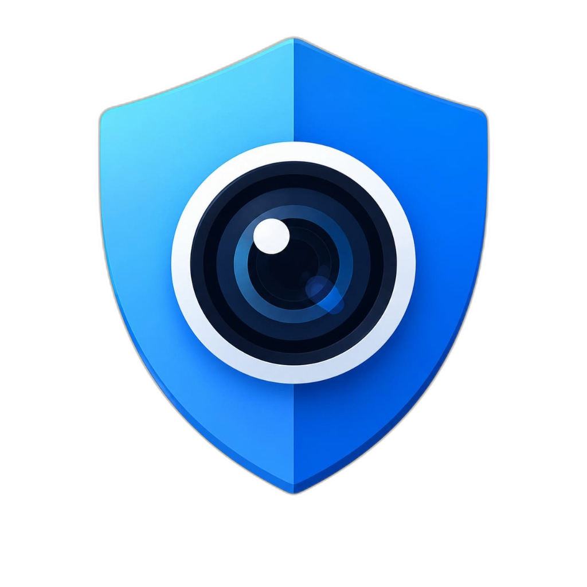

<p align="center">
  
</p>

<h1 align="center">ThreatLens</h1>

<p align="center">
  <b>Cyber-Centric QR Code Security Scanner for Android</b><br/>
  <i>Real-time threat intelligence · Multi-API analysis · On-device heuristics</i>
</p>

<p align="center">
  <a href="#features">Features</a> •
  <a href="#architecture">Architecture</a> •
  <a href="#getting-started">Getting Started</a> •
  <a href="#tech-stack">Tech Stack</a> •
  <a href="#project-structure">Project Structure</a> •
  <a href="#contributing">Contributing</a> •
  <a href="#license">License</a>
</p>

---

## The Problem

Standard camera apps and QR scanners treat QR codes blindly — you scan a code at a restaurant, parking meter, or in an email, and the app instantly opens the link. Bad actors exploit this through **Quishing** (QR code phishing), directing users to credential-stealing pages, malware downloads, or scam payment portals.

## The Solution

**ThreatLens** acts as a real-time security firewall for QR codes. When you scan a QR code, ThreatLens doesn't just read the link — it:

1. **Expands** shortened URLs and unrolls redirect chains
2. **Analyzes** the destination with on-device heuristic rules (offline, instant)
3. **Queries** 12+ world-class threat intelligence APIs concurrently
4. **Classifies** content type (adult, piracy, payment, phishing, etc.)
5. **Calculates** a multi-dimensional trust score (0–100)
6. **Blocks** malicious execution with a visual safety verdict

---

## Features

| Feature | Description |
|---|---|
| 🎯 **Real-Time Camera Scan** | CameraX + ML Kit Barcode Scanning with low-latency detection |
| 🔗 **URL Redirect Unrolling** | Recursively follows HTTP redirect chains (up to 10 hops) |
| 🛡️ **12+ Threat Intelligence APIs** | Google Safe Browsing, VirusTotal, URLhaus, URLScan.io, AbuseIPDB, SSL Labs, Cloudflare Radar, Symantec, Cisco Talos, Spamhaus, CleanBrowsing, OpenPhish |
| 🧠 **On-Device Heuristics** | Homograph attack detection, typosquatting, suspicious TLDs, credential phishing patterns |
| 🏷️ **Smart Content Classification** | 40+ website categories with confidence scores using multi-signal analysis |
| 🔞 **Adult Content Filter** | Detects and blocks NSFW content with domain, TLD, and keyword analysis |
| 💳 **Payment QR Guard** | Detects UPI, cryptocurrency, and payment portal QR codes with fraud warnings |
| 🏴‍☠️ **Piracy Detection** | Identifies known piracy domains and torrent sites |
| 🔒 **Sandbox Browser** | Isolated WebView with disabled cookies/JS for safe URL inspection |
| 📊 **Intelligence Reports** | Detailed threat breakdown with API-by-API verdict visualization |
| 🤖 **AI Categorization** | Multi-signal website categorizer with federated learning |
| 🔐 **Certificate Engine** | HMAC-SHA256 signed QR certificates for verified safe codes |
| 📱 **Quick Settings Tile** | One-tap scan access from Android notification shade |
| 🌐 **Browser Integration** | Register as default browser + share target for link scanning |
| ☁️ **Cloud Sync** | Community threat reports + dynamic dataset updates via Firebase |
| 📈 **Scan History** | Encrypted local database with search, filter, and export |
| 🎨 **QR Generator** | Create QR codes for URLs, WiFi, contacts, events, and more |

---

## Architecture

ThreatLens uses **MVVM (Model-View-ViewModel)** with **Unidirectional Data Flow**:

```
┌─────────────────────────────────────────────────────────────┐
│                    UI Layer (Jetpack Compose)                │
│  ScannerScreen · HistoryScreen · SettingsScreen · Results   │
└──────────────────────┬──────────────────────────────────────┘
                       │
┌──────────────────────▼──────────────────────────────────────┐
│                 ViewModel Layer                              │
│  ScannerViewModel · HistoryViewModel · AuthViewModel        │
└──────────────────────┬──────────────────────────────────────┘
                       │
┌──────────────────────▼──────────────────────────────────────┐
│                    Data Layer                                │
│  ┌─────────────────────────────────────────────────────┐    │
│  │  ScanRepository (Single Source of Truth)             │    │
│  └───────┬────────────────────────┬────────────────────┘    │
│          │                        │                          │
│  ┌───────▼────────┐  ┌───────────▼──────────────────┐      │
│  │ Room Database   │  │ Threat Analysis Pipeline      │      │
│  │ (SQLCipher)     │  │ ┌─────────────────────────┐  │      │
│  └────────────────┘  │ │ URL Expander             │  │      │
│                       │ │ Heuristic Checker        │  │      │
│                       │ │ Website Categorizer      │  │      │
│                       │ │ 12+ Remote APIs (Retrofit)│ │      │
│                       │ └─────────────────────────┘  │      │
│                       └──────────────────────────────┘      │
└─────────────────────────────────────────────────────────────┘
```

### Threat Scoring Algorithm

```
Score = 100 − Σ(API Penalties) − Σ(Heuristic Penalties) + Bonuses
```

| Score Range | Status | Action |
|---|---|---|
| **≥ 80** | 🟢 SAFE | Direct open button |
| **50–79** | 🟡 CAUTION | Highlights threats, warns before opening |
| **< 50** | 🔴 MALICIOUS | Blocks access behind confirmation modal |

---

## Getting Started

### Prerequisites

- **Android Studio** Hedgehog (2023.1.1) or later
- **JDK 17**
- **Android SDK** API 34 (compileSdk) / API 26 (minSdk)

### Setup

1. **Clone the repository**
   ```bash
   git clone https://github.com/YOUR_USERNAME/ThreatLens.git
   cd ThreatLens
   ```

2. **Configure API keys**
   ```bash
   cp local.properties.example local.properties
   ```
   Edit `local.properties` and fill in your API keys. The app works without them but skips those API checks.

3. **Firebase setup**
   - Create a Firebase project at [console.firebase.google.com](https://console.firebase.google.com)
   - Enable Authentication (Google Sign-In) and Firestore
   - Download `google-services.json` and place it in `app/`

4. **Build & Run**
   ```bash
   ./gradlew assembleDebug
   ```
   Or open in Android Studio and click ▶️ Run.

---

## Tech Stack

| Layer | Technology |
|---|---|
| **Language** | Kotlin |
| **UI Framework** | Jetpack Compose + Material 3 |
| **Architecture** | MVVM + UDF |
| **Camera** | CameraX |
| **QR Detection** | Google ML Kit Barcode Scanning |
| **QR Generation** | ZXing Core |
| **Networking** | Retrofit + OkHttp |
| **Database** | Room ORM + SQLCipher |
| **Auth** | Firebase Auth + Google Sign-In |
| **Cloud** | Firebase Firestore |
| **Background Work** | WorkManager |
| **AI** | Google Gemini (Generative AI) |
| **Security** | EncryptedSharedPreferences, Biometric API, HMAC-SHA256 |
| **Dependency Injection** | Manual (singleton pattern) |
| **Build System** | Gradle (Kotlin DSL) |

---

## Project Structure

```
app/src/main/java/com/safeqr/scanner/
├── MainActivity.kt                  # Entry point, intent handling
├── SafeQRApplication.kt             # Application class, initialization
├── analysis/                         # Threat analysis engine
│   ├── ThreatAnalyzer.kt            # Main analysis orchestrator (12+ APIs)
│   ├── HeuristicChecker.kt          # Offline heuristic rules engine
│   ├── QrDataParser.kt              # QR data type parser (URL, WiFi, etc.)
│   ├── UrlExpander.kt               # HTTP redirect chain unroller
│   ├── WebsiteCategorizer.kt        # Multi-signal website categorizer
│   ├── AILearningEngine.kt          # On-device ML threat scoring
│   ├── AIFederatedWorker.kt         # Background federated learning sync
│   └── WebshrinkerClient.kt         # Enterprise categorization API client
├── data/
│   ├── ApiKeys.kt                   # BuildConfig-backed API key accessor
│   ├── PreferencesManager.kt        # SharedPreferences wrapper
│   ├── SecureVaultManager.kt        # Encrypted credential storage
│   ├── local/                       # Room database, DAOs, entities
│   ├── model/                       # Data classes (ScanResult, SafetyStatus)
│   ├── remote/                      # Retrofit API interfaces (17 services)
│   └── repository/                  # ScanRepository (single source of truth)
├── navigation/
│   └── NavGraph.kt                  # Compose Navigation graph
├── security/
│   └── CertificateEngine.kt         # HMAC-SHA256 QR certificate system
├── service/
│   ├── ScannerTileService.kt        # Quick Settings tile
│   └── WeeklyDigestWorker.kt        # Background weekly scan digest
├── ui/
│   ├── components/                  # Reusable UI components
│   ├── screens/                     # Full-screen Composables
│   └── theme/                       # Material 3 theme, colors, typography
├── utils/
│   └── SmartRouter.kt               # Deep link routing utility
└── viewmodel/                       # ViewModels for each feature
```

---

## Team

The following team members contributed to building ThreatLens:

* **[Your Name Here]** - Project Lead / Developer
* **[Team Member 2 Name]** - [Role]
* **[Team Member 3 Name]** - [Role]

*(Note: Once you add your team members on GitHub, they will also automatically appear in the "Contributors" sidebar on the right side of the repository page!)*

---

## Contributing

Contributions are welcome! Please:

1. Fork the repository
2. Create a feature branch (`git checkout -b feature/amazing-feature`)
3. Commit your changes (`git commit -m 'Add amazing feature'`)
4. Push to the branch (`git push origin feature/amazing-feature`)
5. Open a Pull Request

---

## License

This project is licensed under the MIT License — see the [LICENSE](LICENSE) file for details.

---

<p align="center">
  Built with 🛡️ by the ThreatLens Team
</p>
