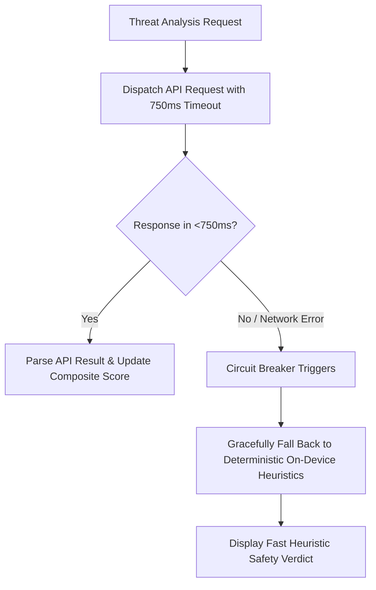

# 🌐 THREATLENS: API & Threat Feed Integration Specification

This document provides the complete API specification for the **ThreatLens** ecosystem. It covers both the internal Chromium Extension IPC message passing protocol and the external threat intelligence REST APIs.

---

## 1. Protocol Architecture Overview

ThreatLens utilizes two distinct communication protocols:
1. **Internal IPC (Chromium Message Passing)**: High-speed asynchronous message passing between content scripts, the popup UI, the dashboard HUD, and the background service worker via `chrome.runtime.sendMessage` and `chrome.tabs.sendMessage`.
2. **External Threat Feeds (HTTPS REST / TLS 1.3)**: Concurrent REST API queries dispatched to world-class cybersecurity intelligence providers, secured via TLS 1.3 with strict timeouts and circuit breaker patterns.

---

## 2. Internal Chrome Extension IPC Message Passing Actions

### 2.1 Message: `ANALYZE_URL` / `ANALYZE_PAYLOAD`
Dispatched by content scripts, popup, or dashboard to evaluate a URL or text string.

- **Sender**: Content Script / Popup / Dashboard
- **Receiver**: Background Service Worker (`service-worker.js`)
- **Request Payload**:
  ```json
  {
    "action": "ANALYZE_URL",
    "url": "https://suspicious-banking-update.xyz/login",
    "isFastLinkScan": true
  }
  ```
- **Response Payload (Success)**:
  ```json
  {
    "rawContent": "https://suspicious-banking-update.xyz/login",
    "expandedUrl": "https://suspicious-banking-update.xyz/login",
    "redirectChain": ["https://suspicious-banking-update.xyz/login"],
    "domain": "suspicious-banking-update.xyz",
    "safetyStatus": "MALICIOUS",
    "overallScore": 15,
    "riskScore": 85,
    "threatType": "PHISHING",
    "flags": [
      "High-risk top-level domain (.xyz)",
      "Credential harvesting keyword detected (login)",
      "Flagged by Google Safe Browsing"
    ],
    "siteCategory": "🔴 Phishing Site",
    "siteSummary": "Verified credential phishing portal impersonating banking services.",
    "aiInsight": "ThreatLens flagged this destination due to deceptive login parameters hosted on an untrusted .xyz domain. Do not submit personal or banking credentials.",
    "timestamp": 1726852800000
  }
  ```

---

### 2.2 Message: `FETCH_SANDBOX_HTML`
Fetches a remote webpage via background `fetch()` with custom user-agent spoofing, strips dangerous scripts and tracker pixels, and returns sanitized HTML for isolated rendering.

- **Request Payload**:
  ```json
  {
    "action": "FETCH_SANDBOX_HTML",
    "url": "https://example-test.com",
    "isDesktop": true,
    "allowScripts": false
  }
  ```
- **Response Payload**:
  ```json
  {
    "success": true,
    "sanitizedHtml": "<!DOCTYPE html><html><head><base href=\"...\">...</head><body>...</body></html>",
    "rawHtml": "<!DOCTYPE html>...",
    "telemetry": {
      "scriptsStripped": 14,
      "formsDisarmed": 2,
      "iframesFound": 1,
      "passwordInputs": 1,
      "blockedTrackers": [
        "Blocked & Isolated Tracker Keyword: google-analytics",
        "Blocked & Isolated Tracker Keyword: doubleclick"
      ]
    }
  }
  ```

---

### 2.3 Message: `BUILD_CERTIFIED_QR`
Invokes the cryptographic certificate engine to build an anti-tamper QR code payload with an HMAC-SHA256 signature.

- **Request Payload**:
  ```json
  {
    "action": "BUILD_CERTIFIED_QR",
    "content": "https://verified-company.com/portal",
    "safetyStatus": "SAFE",
    "score": 100
  }
  ```
- **Response Payload**:
  ```json
  {
    "success": true,
    "certString": "TL-CERT:v1|https://verified-company.com/portal|100|SAFE|1726852800|a3f129c9e87b..."
  }
  ```

---

### 2.4 Message: `START_SCREEN_SNIP`
Triggers the interactive screen-snip overlay on the active browser tab (Alt+Q shortcut).

- **Request Payload**:
  ```json
  { "action": "START_SCREEN_SNIP" }
  ```
- **Response**: `{ "success": true }`

---

### 2.5 Message: `TOGGLE_GLOBAL_ADSHIELD`
Enables or disables all Declarative Net Request static rulesets globally.

- **Request Payload**:
  ```json
  { "action": "TOGGLE_GLOBAL_ADSHIELD" }
  ```
- **Response Payload**:
  ```json
  {
    "success": true,
    "adShieldEnabled": false
  }
  ```

---

### 2.6 Message: `TOGGLE_SITE_WHITELIST`
Toggles a domain in the Declarative Net Request dynamic whitelist ruleset (Rule IDs 10000..19999).

- **Request Payload**:
  ```json
  {
    "action": "TOGGLE_SITE_WHITELIST",
    "domain": "trusted-portal.com"
  }
  ```
- **Response Payload**:
  ```json
  {
    "success": true,
    "isWhitelisted": true,
    "whitelistedDomains": ["trusted-portal.com"]
  }
  ```

---

## 3. External Threat Intelligence REST APIs

### 3.1 Google Safe Browsing API v4
- **Endpoint**: `POST https://safebrowsing.googleapis.com/v4/threatMatches:find?key={SAFE_BROWSING_KEY}`
- **Headers**: `Content-Type: application/json`
- **Request Body**:
  ```json
  {
    "client": {
      "clientId": "threatlens-mobile-scanner",
      "clientVersion": "1.0.0"
    },
    "threatInfo": {
      "threatTypes": ["MALWARE", "SOCIAL_ENGINEERING", "UNWANTED_SOFTWARE", "POTENTIALLY_HARMFUL_APPLICATION"],
      "platformTypes": ["ANY_PLATFORM"],
      "threatEntryTypes": ["URL"],
      "threatEntries": [
        { "url": "https://malicious-phishing-target.com" }
      ]
    }
  }
  ```
- **Response Body**:
  ```json
  {
    "matches": [
      {
        "threatType": "SOCIAL_ENGINEERING",
        "platformType": "ANY_PLATFORM",
        "threatEntryType": "URL",
        "threat": { "url": "https://malicious-phishing-target.com" },
        "cacheDuration": "300s"
      }
    ]
  }
  ```

---

### 3.2 VirusTotal API v3
- **Endpoint**: `POST https://www.virustotal.com/api/v3/urls`
- **Headers**:
  - `x-apikey: {VIRUS_TOTAL_KEY}`
  - `Content-Type: application/x-www-form-urlencoded`
- **Request Body**: `url=https%3A%2F%2Fsuspicious-site.com`
- **Response**: Returns analysis ID. ThreatLens then queries `GET https://www.virustotal.com/api/v3/analyses/{id}`:
  ```json
  {
    "data": {
      "attributes": {
        "status": "completed",
        "stats": {
          "harmless": 65,
          "malicious": 8,
          "suspicious": 2,
          "undetected": 10
        }
      }
    }
  }
  ```

---

### 3.3 AbuseIPDB API v2
- **Endpoint**: `GET https://api.abuseipdb.com/api/v2/check?ipAddress={ipAddress}&maxAgeInDays=90`
- **Headers**:
  - `Key: {ABUSE_IPDB_KEY}`
  - `Accept: application/json`
- **Response Body**:
  ```json
  {
    "data": {
      "ipAddress": "198.51.100.42",
      "isPublic": true,
      "abuseConfidenceScore": 87,
      "countryCode": "RU",
      "usageType": "Data Center/Web Hosting/Transit",
      "isp": "BadHost Networks Ltd",
      "totalReports": 412,
      "numDistinctUsers": 89,
      "lastReportedAt": "2026-09-20T14:22:00+00:00"
    }
  }
  ```

---

### 3.4 URLScan.io API v1
- **Endpoint**: `POST https://urlscan.io/api/v1/scan/`
- **Headers**:
  - `API-Key: {URL_SCAN_IO_KEY}`
  - `Content-Type: application/json`
- **Request Body**:
  ```json
  {
    "url": "https://target-domain.com",
    "visibility": "unlisted"
  }
  ```
- **Response**: Polls `GET https://urlscan.io/api/v1/result/{uuid}/` to retrieve DOM screenshot, detected malicious IP links, and SSL certificate issuer details.

---

### 3.5 LLM7.io Cloud AI API (Neural Threat Reasoning)
- **Endpoint**: `POST https://api.llm7.io/v1/chat/completions`
- **Headers**:
  - `Authorization: Bearer {LLM7_API_KEY}`
  - `Content-Type: application/json`
- **Request Body**:
  ```json
  {
    "model": "llm7-fast-security",
    "temperature": 0.2,
    "max_tokens": 150,
    "messages": [
      {
        "role": "system",
        "content": "You are ThreatLens AI Security Analyst. Analyze the provided URL, domain features, and heuristic flags. Provide a 2-sentence plain-English threat summary explaining why the site is risky or safe."
      },
      {
        "role": "user",
        "content": "URL: https://secure-bank-login.xyz\nFlags: [Punycode homoglyph, Brand impersonation: Bank, High-risk TLD: .xyz]"
      }
    ]
  }
  ```
- **Response Body**:
  ```json
  {
    "id": "chatcmpl-7x8921",
    "choices": [
      {
        "message": {
          "role": "assistant",
          "content": "ThreatLens flagged this link because it uses an unauthorized .xyz domain mimicking a legitimate banking login page. Entering credentials on this page will expose your account to identity theft and financial fraud."
        }
      }
    ]
  }
  ```

---

## 4. Rate Limiting, Timeouts & Circuit Breaker Architecture

To guarantee the user interface never freezes during an external service degradation:



- **Timeout Policy**: 750ms strict per-request timeout via OkHttp `callTimeout` on Android and `AbortController` in the Chrome extension.
- **HTTP 429 Handling**: Automatically backs off and pauses remote API requests for 60 seconds if rate limit thresholds are reached, using local heuristics and cached verdicts in the interim.
