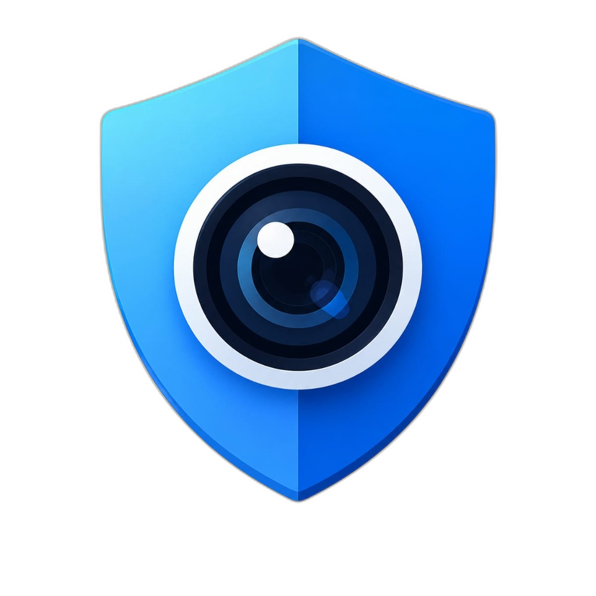
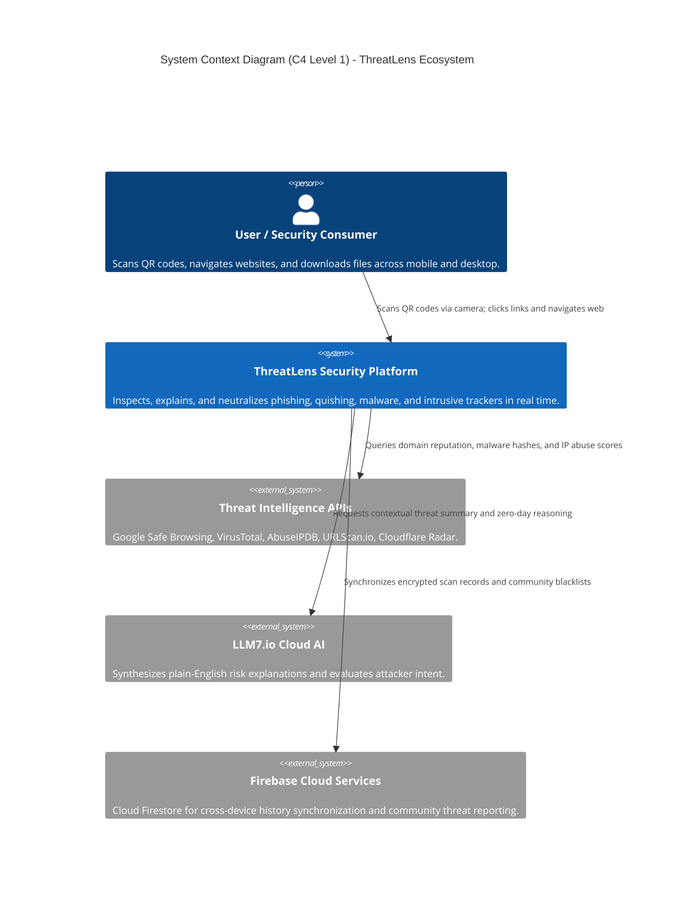
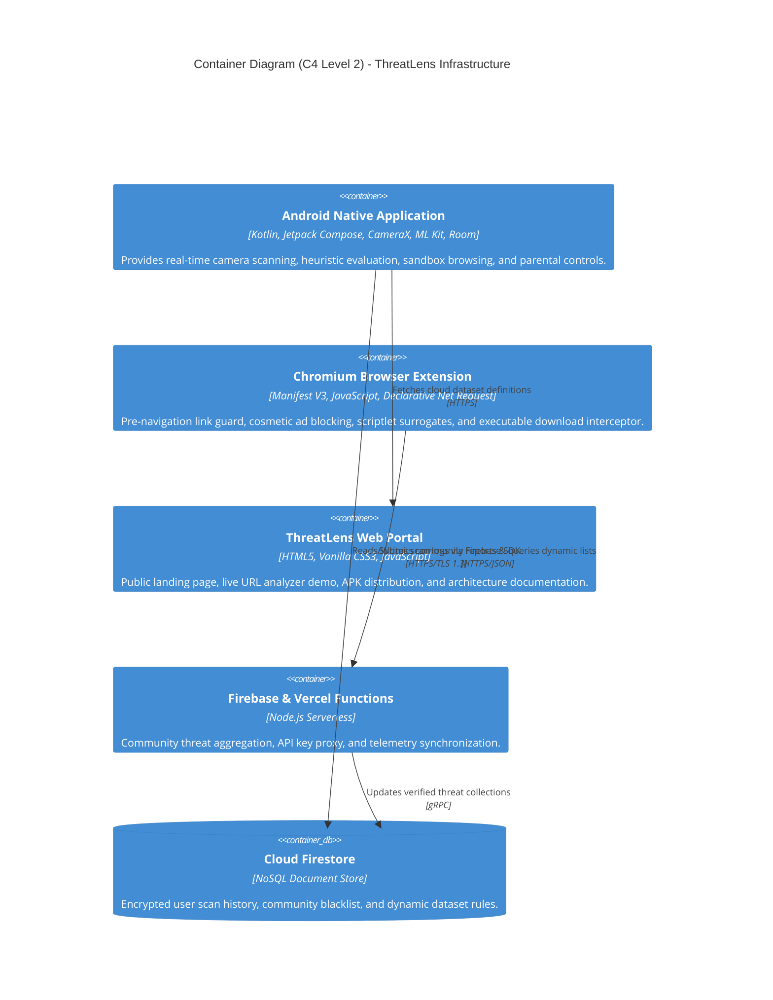
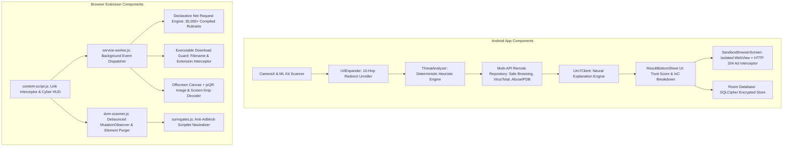

# 🛡️ THREATLENS: Master Engineering Whitepaper & Technical Architecture Specification

<div align="center">



### **Next-Generation Multi-Platform Cybersecurity Intelligence & Threat Defense Ecosystem**
*Engineered for Sub-Second Mobile Threat Interception, High-Throughput Declarative Net Request Shielding, and Explainable AI Security Reasoning.*

---

[](https://kotlinlang.org)
[](https://developer.android.com)
[](https://developer.android.com/jetpack/compose)
[](https://developer.chrome.com/docs/extensions/mv3/)
[](https://developer.android.com/training/data-storage/room)
[](https://firebase.google.com/docs/firestore)
[](API_Specification.md)

</div>

---

## 📋 Document Control & Metadata

| Specification Attribute | Value |
| :--- | :--- |
| **System Name** | **ThreatLens Cybersecurity Ecosystem** |
| **Document Classification** | Master Engineering Whitepaper & Technical Architecture Specification |
| **Release Target** | Version 1.0.0 (Production Release / Build 1) |
| **Target Mobile Environment** | Android 8.0 (API Level 26) through Android 15 (API Level 35) |
| **Target Desktop Environment** | Chromium Engines (Google Chrome, Microsoft Edge, Brave, Opera) Manifest V3 |
| **Primary Architecture Pattern** | MVVM with Unidirectional Data Flow (Android) / Event-Driven Service Worker (MV3) |
| **Data Persistence Engine** | Android Room v18 SQLite encrypted with SQLCipher (256-bit AES) + `chrome.storage.local` |
| **Distributed Cloud Sync** | Firebase Cloud Firestore + Firebase Cloud Functions + Vercel Serverless API Proxy |
| **Threat Intelligence Engines** | On-Device Heuristics + 12 Multi-Engine APIs (Google Safe Browsing, VirusTotal, AbuseIPDB, URLScan) |
| **AI Threat Explanation** | LLM7.io Cloud AI Neural Reasoning API |

---

## 📑 Comprehensive Table of Contents

1. [Executive Summary & Problem Domain](#1-executive-summary--problem-domain)
2. [C4 Architectural Blueprint](#2-c4-architectural-blueprint)
   - 2.1 [System Context (Level 1)](#21-system-context-diagram-c4-level-1)
   - 2.2 [Container Architecture (Level 2)](#22-container-architecture-diagram-c4-level-2)
   - 2.3 [Component Breakdown (Level 3)](#23-component-breakdown-c4-level-3)
   - 2.4 [Runtime Execution Lifecycle (Level 4)](#24-runtime-execution-lifecycle-c4-level-4)
3. [Core Subsystem Specifications](#3-core-subsystem-specifications)
   - 3.1 [Quishing & Camera Vision Subsystem (Android)](#31-quishing--camera-vision-subsystem-android)
   - 3.2 [Deterministic Heuristic Engine & Redirect Unrolling](#32-deterministic-heuristic-engine--redirect-unrolling)
   - 3.3 [Declarative Net Request (DNR) Ad & Tracker Shield (Extension)](#33-declarative-net-request-dnr-ad--tracker-shield-extension)
   - 3.4 [Pre-Navigation Link Guard & Cyber HUD](#34-pre-navigation-link-guard--cyber-hud)
   - 3.5 [Isolated Sandbox Browser & Parental Controls](#35-isolated-sandbox-browser--parental-controls)
   - 3.6 [Cryptographic Anti-Tamper Certified QR Engine](#36-cryptographic-anti-tamper-certified-qr-engine)
   - 3.7 [Executable Download Interceptor & Binary Malware Guard](#37-executable-download-interceptor--binary-malware-guard)
   - 3.8 [Explainable AI Reasoning (LLM7.io Engine)](#38-explainable-ai-reasoning-llm7io-engine)
4. [Relational Data Layer & Schema Overview](#4-relational-data-layer--schema-overview)
5. [Hardware Security, Cryptography & Threat Modeling](#5-hardware-security-cryptography--threat-modeling)
6. [Sub-Documentation Directory & Index](#6-sub-documentation-directory--index)

---

## 1. Executive Summary & Problem Domain

### 1.1 The Core Problem
**A QR code is not the threat; the destination website it forces your device to open is.**

Standard smartphone cameras and basic barcode readers suffer from a critical architectural flaw: they blindly open scanned URLs without pre-navigation threat inspection. Cybercriminals actively exploit this through **Quishing (QR Phishing)**:
1. Attackers print fraudulent QR code stickers and physically paste them over legitimate QR codes at parking meters, restaurant tables, transit kiosks, and payment counters.
2. When an unsuspecting user scans the code, their device immediately launches a web browser pointing to a credential harvesting site, a fraudulent payment gateway (e.g., fake UPI/banking requests), or a silent malware payload.
3. On desktop browsers, users encounter shortened links (`bit.ly`, `tinyurl`), multi-hop redirect chains, and deceptive executable downloads without pre-download reputation checks.
4. Traditional security tools provide opaque binary verdicts ("Safe" or "Dangerous") without explaining *why*, leaving users vulnerable to future social engineering tactics.

### 1.2 The ThreatLens Solution
ThreatLens establishes a unified, cross-platform security fabric:
- **On Android**: A native Kotlin application combines Google ML Kit CameraX scanning, recursive redirect unrolling, on-device heuristics (<50ms), and an isolated in-app Sandbox Browser with ad/tracker blocking and child safety controls.
- **On Desktop**: A Chromium Manifest V3 extension intercepts link clicks before navigation, displays a Loanzo Light Cyber HUD with concentric radar rings, filters ads and tracking networks via Declarative Net Request (30,000+ rules), intercepts dangerous file downloads, and neutralizes anti-adblock walls using scriptlet surrogates.
- **Explainable Intelligence**: Results are synthesized into an intuitive 0–100 Trust Score with plain-English threat breakdowns powered by the **LLM7.io Cloud AI API**.

---

## 2. C4 Architectural Blueprint

### 2.1 System Context Diagram (C4 Level 1)



### 2.2 Container Architecture Diagram (C4 Level 2)



### 2.3 Component Breakdown (C4 Level 3)



---

## 3. Core Subsystem Specifications

### 3.1 Quishing & Camera Vision Subsystem (Android)
- **Scanning Engine**: CameraX bound to the Android Lifecycle with continuous autofocus.
- **Detection Algorithm**: Google ML Kit Barcode Scanning API configured specifically for `FORMAT_QR_CODE`.
- **Latency**: Processes frames in under 45ms per frame on mid-range hardware (Snapdragon 680 / Helio G99).
- **Haptic & Audio Feedback**: Triggers instantaneous `ToneGenerator` beep and subtle haptic pulse upon detection.

### 3.2 Deterministic Heuristic Engine & Redirect Unrolling
1. **Recursive Redirect Unrolling (`UrlExpander.kt` / `UrlExpander.js`)**: Follows up to 10 consecutive HTTP `301`, `302`, `307`, and `308` redirects to identify the final landing destination. Unwraps search engine gateways (Google `/url?q=`, Bing `/ck/a`, DuckDuckGo `/l/?uddg=`).
2. **Deterministic Heuristic Rules (`ThreatAnalyzer.kt` / `HeuristicsEngine.js`)**:
   - **Shannon Entropy**: Measures domain randomness; values $> 4.2$ trigger high entropy alerts (algorithmically generated domains / DGA).
   - **Homoglyph & Punycode Detection**: Flags Cyrillic/Greek lookalike Unicode characters and `xn--` Punycode prefixes.
   - **IP Host Detection**: Flags direct public IP addresses used in place of registered domain names.
   - **Authority Section Phishing**: Identifies `@` symbols in the URL authority section used to obscure true destinations.
   - **Subdomain Depth Penalty**: Evaluates domain structure, flagging domains with more than 3 subdomain levels.
   - **High-Risk TLDs**: Flags known abuse TLDs (`.xyz`, `.top`, `.pw`, `.buzz`, `.gripe`, `.bet`, `.lol`).

### 3.3 Declarative Net Request (DNR) Ad & Tracker Shield (Extension)
- **Manifest V3 Native Filtering**: Replaces deprecated `webRequestBlocking` with `chrome.declarativeNetRequest`.
- **Compiled Rulesets**:
  - `adblock_ads.json` (15,000+ rules): Blocks major advertising exchanges (DoubleClick, Google AdServices, Taboola, Outbrain, PopAds).
  - `adblock_trackers.json` (10,000+ rules): Blocks telemetry, user fingerprinting, and session recording endpoints (Clarity, Hotjar, Criteo).
  - `adblock_malware.json` (5,000+ rules): Blocks known drive-by download domains and crypto-mining endpoints.
- **Dynamic Whitelist Synchronization**: Allocates dedicated rule IDs (`10000..19999`) to allow user-whitelisted sites to bypass blocking dynamically.

### 3.4 Pre-Navigation Link Guard & Cyber HUD
- **Interception Mechanism**: Intercepts `click`, `mousedown`, and `pointerdown` events on anchor tags before navigation occurs.
- **Cyber HUD Design System**: Renders a full-screen Loanzo Light HUD (`rgba(248, 250, 253, 0.96)`) featuring four concentric SVG radar rings rotating with smooth cubic-bezier easing, cycling through real-time scan phases (DNS, SSL, Heuristics, Threat DB, AI Synthesis).
- **Preemptive `target="_blank"` Neutralization**: Temporarily rewires `target="_blank"` to `_self` to prevent the browser engine from spawning empty background tabs prematurely before security analysis finishes.

### 3.5 Isolated Sandbox Browser & Parental Controls
- **Zero-Storage Isolation**: Android WebView configured with disabled DOM storage, no cookies, no cache persistence, and disabled popups (`onCreateWindow` returns false).
- **HTTP 204 Ad Interception**: Overrides `shouldInterceptRequest` to block ad and tracker resources with HTTP 204 (No Content) and `Access-Control-Allow-Origin: *`, preventing broken image icons or console MIME warnings.
- **Parental Controls**: Password-protected PIN lock enforcing bedtime schedules, safe-search restrictions, and domain blacklists.

### 3.6 Cryptographic Anti-Tamper Certified QR Engine
- Generates certified QR codes embedding tamper-evident cryptographic metadata:
  ```json
  {
    "threatlens_certified": true,
    "payload": "https://company.com/secure-portal",
    "trust_score": 100,
    "safety_status": "SAFE",
    "issued_at": 1726852800000,
    "signature": "HMAC_SHA256(payload + score + issued_at, MasterSecret)"
  }
  ```
- Any alteration to the destination URL invalidates the HMAC signature, alerting recipients immediately.

### 3.7 Executable Download Interceptor & Binary Malware Guard
- Intercepts dangerous file extensions (`.exe`, `.scr`, `.bat`, `.vbs`, `.iso`, `.msi`, `.apk`, `.cmd`, `.ps1`) via `chrome.downloads.onCreated` and `chrome.downloads.onDeterminingFilename`.
- Automatically pauses suspicious binary downloads and presents a high-priority Chrome Notification allowing the user to inspect the source domain before resuming or canceling.

### 3.8 Explainable AI Reasoning (LLM7.io Engine)
- Contextual threat analysis powered by the **LLM7.io Cloud AI API**.
- Evaluates raw URL parameters, redirect history, and heuristic flags to produce a 2-sentence natural language summary explaining the attacker's intent and specific danger (e.g., credential phishing, banking impersonation, or scareware).

---

## 4. Relational Data Layer & Schema Overview

ThreatLens employs an offline-first data persistence model:
1. **Android Room Database (v18 SQLite)**:
   - Encrypted with **SQLCipher (256-bit AES-CBC)**.
   - Master key managed securely via Android KeyStore.
   - Core tables: `scan_history`, `community_reports`, `parental_configs`, `whitelist_domains`.
2. **Cloud Firestore**:
   - Stores cross-device scan history under `/users/{uid}/scans/{scanId}`.
   - Stores crowd-sourced threat reports under `/threat_reports/{reportId}`.
3. **Chrome Extension Local Storage (`chrome.storage.local`)**:
   - Stores custom zapped CSS selectors, dynamic whitelisted domains, lifetime blocked counters, and temporary threat report caches (bounded with FIFO/LRU eviction).

---

## 5. Hardware Security, Cryptography & Threat Modeling

### 5.1 STRIDE Threat Matrix
| Threat Category | Potential Attack Vector | ThreatLens Mitigation |
| :--- | :--- | :--- |
| **Spoofing** | Malicious QR sticker pasted over legitimate QR code | Pre-navigation URL expansion, heuristic inspection, and domain verification. |
| **Tampering** | Man-in-the-middle payload manipulation | Cryptographically signed QR certificates (HMAC-SHA256) and TLS 1.3 enforcement. |
| **Repudiation** | Denying submission of fraudulent links | Encrypted local audit logs in SQLCipher Room database. |
| **Information Disclosure** | Tracker pixels collecting user browsing habits | Declarative Net Request tracking ruleset + Sandbox Browser cookie isolation. |
| **Denial of Service** | Infinite alert loops or DOM mutation thrashing | Alert spam freeze loop defeater + debounced MutationObserver with 200ms throttle. |
| **Elevation of Privilege** | Transparent clickjacking trap overlays | Automated DOM sweeper removing transparent elements with high z-index ($>999$). |

---

## 6. Sub-Documentation Directory & Index

The complete ThreatLens engineering documentation suite is organized in the `docs/` directory:

| Document | Description |
| :--- | :--- |
| [**SystemArchitecture.md**](SystemArchitecture.md) | C4 Architecture Diagrams (Levels 1–4), Sequence Diagrams, and Component Workflows. |
| [**SRS.md**](SRS.md) | Software Requirements Specification (IEEE 830, Functional FR-01..25 & Non-Functional NFR-01..10). |
| [**Database_Schema_and_Migrations.md**](Database_Schema_and_Migrations.md) | Room SQLCipher Schema, Entity Models, Migrations, Firestore Collections, and Storage Local. |
| [**API_Specification.md**](API_Specification.md) | Complete REST API, Message Passing IPC, and Threat Feed Integration Specifications. |
| [**Security_and_Cryptography.md**](Security_and_Cryptography.md) | Detailed Cryptography, Threat Modeling (STRIDE/DREAD), KeyStore Vault, and DNR Shield. |
| [**Feasibility_Study_Document.md**](Feasibility_Study_Document.md) | Technical, Operational, Economic, Schedule, and Legal/Privacy Feasibility Analysis. |
| [**Developer_Guide.md**](Developer_Guide.md) | Local Setup, Building Android APK, Loading Chrome MV3 Extension, and Coding Standards. |
| [**TestingStrategy.md**](TestingStrategy.md) | Unit, Integration, UI, Security Penetration, and Performance Benchmark Plans. |
