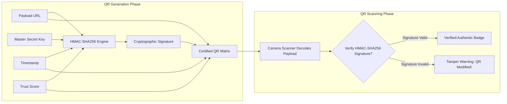

# 🔐 THREATLENS: Security, Cryptography & Threat Modeling Specification

This document provides the complete security engineering and cryptographic specification for the **ThreatLens** ecosystem. It details the **STRIDE** and **DREAD** threat modeling matrices, cryptographic signing and encryption algorithms, and Manifest V3 security boundaries.

---

## 1. Threat Modeling (STRIDE & DREAD Methodology)

### 1.1 STRIDE Threat Analysis Matrix

| Threat Category | Target Asset / Component | Threat Description | ThreatLens Architectural Mitigation |
| :--- | :--- | :--- | :--- |
| **Spoofing** | Camera Scanner / User Perception | Attacker pastes a fraudulent physical QR code over a legitimate merchant or parking meter QR code. | **Pre-Navigation Inspection**: Scanned URLs are not opened automatically. `UrlExpander` traces full redirect paths and `ThreatAnalyzer` validates domain authenticity. |
| **Spoofing** | Domain Identity | Attacker registers a Cyrillic/Greek homoglyph domain (`xn--...`) mimicking a legitimate brand. | **Homoglyph Detection**: Automated Unicode inspection identifies lookalike characters and punycode strings, applying an immediate 80-point penalty. |
| **Tampering** | QR Code Payload | Man-in-the-middle attacker modifies printed QR parameters or redirects. | **Cryptographic Verification**: `CertificateEngine` embeds HMAC-SHA256 signatures in Certified QR codes to detect unauthorized alterations. |
| **Repudiation** | Community Reporting | Malicious actor spams false-positive or false-negative community threat reports. | **Cloud Authentication & Rate Limiting**: Community reports require Firebase Auth and are rate-limited per user UID with reputation weighting. |
| **Information Disclosure** | Local Scan History | An attacker steals an unlocked device to extract visited URLs and scan logs. | **At-Rest Encryption**: Local database is encrypted with SQLCipher using 256-bit AES-CBC; encryption keys reside in the hardware-backed Android KeyStore. |
| **Information Disclosure** | Browsing Behavior | Ad networks and tracker pixels record user browsing patterns. | **Declarative Net Request Shield**: 30,000+ compiled DNR rules block telemetry and tracker requests at the network layer before connection setup. |
| **Denial of Service** | Browser Event Loop | Malicious site executes infinite `alert()` freeze loops or triggers continuous DOM mutations. | **Alert Freeze Defeater & Debouncing**: In-page script neutralizes rapid repeated `alert()` dialogs and throttles `MutationObserver` with a 200ms debounce. |
| **Elevation of Privilege** | DOM Clickjacking | Malicious page positions a transparent iframe or link over benign buttons. | **Clickjacking Trap Sweeper**: Identifies and strips fixed/absolute elements with $z\text{-index} > 999$ and opacity $\approx 0$ that cover $>70\%$ of viewport. |

---

### 1.2 DREAD Risk Assessment Matrix

The DREAD score is calculated as:
$$\text{Risk Score} = \frac{D + R + E + A + D}{5}$$
*(Scale: 1 = Low, 10 = Critical)*

| Vulnerability / Attack Scenario | Damage (D) | Reproducibility (R) | Exploitability (E) | Affected Users (A) | Discoverability (D) | Overall DREAD | Severity |
| :--- | :---: | :---: | :---: | :---: | :---: | :---: | :--- |
| **Physical Quishing Sticker Attack** | 9 | 9 | 8 | 9 | 9 | **8.8** | 🔴 Critical |
| **Cyrillic Homoglyph Brand Impersonation** | 8 | 8 | 7 | 8 | 7 | **7.6** | 🟠 High |
| **Drive-By Executable Download** | 9 | 7 | 6 | 8 | 6 | **7.2** | 🟠 High |
| **Transparent Clickjacking Overlay** | 6 | 8 | 7 | 7 | 8 | **7.2** | 🟠 High |
| **Invasive Ad Tracking & Fingerprinting** | 5 | 9 | 9 | 10 | 8 | **8.2** | 🟠 High |
| **Anti-Adblock Paywall Evasion** | 4 | 7 | 5 | 6 | 7 | **5.8** | 🟡 Medium |

---

## 2. Cryptographic Architecture & Specifications

### 2.1 Certified QR Code Verification (HMAC-SHA256)
ThreatLens introduces cryptographically verifiable QR codes to prevent unauthorized modification of payment links, contact cards, and corporate landing pages:



#### Verification Algorithm:
$$\text{Signature} = \text{HMAC-SHA256}\Big(K_{\text{master}},\, \text{payload} \mathbin{\Vert} \text{score} \mathbin{\Vert} \text{timestamp}\Big)$$

- **Algorithm**: `HmacSHA256` (FIPS 198-1 conforming).
- **Key Length**: 256-bit cryptographically secure pseudorandom key.
- **Payload Format**: `TL-CERT:v1|{payload}|{trust_score}|{status}|{timestamp}|{hex_signature}`.

---

### 2.2 Local Database Encryption (SQLCipher 256-bit AES-CBC)
- **Engine**: SQLCipher v4.5+ integration with Android Room.
- **Cipher Suite**: `AES-256-CBC` with PBKDF2 key derivation (64,000 iterations) and HMAC-SHA512 per-page authentication.
- **Key Storage**: Passphrase generated via `SecureRandom` and stored in `AndroidKeyStore` using the `MasterKey` builder:
  ```kotlin
  val masterKey = MasterKey.Builder(context)
      .setKeyScheme(MasterKey.KeyScheme.AES256_GCM)
      .build()
  ```

---

### 2.3 Parental Lock PIN Security
- **Algorithm**: `PBKDF2WithHmacSHA256`.
- **Salt**: 16 bytes generated from `java.security.SecureRandom`.
- **Iterations**: 100,000 rounds.
- **Output**: 32-byte hex-encoded hash stored in the encrypted `parental_configs` table.

---

## 3. Manifest V3 Security & Network Shielding

### 3.1 Declarative Net Request vs Deprecated `webRequestBlocking`
In legacy Manifest V2 extensions, ad blockers intercepted every network request on the JavaScript thread using `chrome.webRequest.onBeforeRequest`, which introduced CPU overhead and privacy risks (the extension had visibility into all unencrypted request headers).

ThreatLens uses Manifest V3 **Declarative Net Request (DNR)**:
1. Rules are compiled into optimized browser-internal regex and domain lookup trees.
2. The browser engine matches network requests at the C++ level before socket connection establishment.
3. Zero JavaScript thread execution is required to block an ad, eliminating frame drops and preserving device battery.

---

### 3.2 Scriptlet Surrogates & Main-World Execution
Certain modern websites detect ad blockers by testing if specific global variables (e.g., `window.adsbygoogle`, `window.ga`) are defined. If undefined, the site displays an anti-adblock wall or refuses to render.

ThreatLens deploys **Main-World Scriptlet Surrogates (`surrogates.js`)**:
- Injected via `chrome.scripting.registerContentScripts` with `world: "MAIN"`.
- Executes before any page scripts run (`runAt: "document_start"`).
- Stubs tracker objects with zero-overhead dummy objects that report success without actually transmitting any telemetry.

```javascript
// Google AdSense Neutralizer Surrogate
window.adsbygoogle = {
  push: function(args) { return Array.isArray(args) ? args.length : 0; },
  loaded: true
};
window.isAdBlockActive = false;
window.canRunAds = true;
```

---

### 3.3 Content Security Policy (CSP)
Extension pages (`popup.html`, `dashboard.html`, `sandbox.html`) enforce a strict Content Security Policy defined in `manifest.json`:
```json
{
  "content_security_policy": {
    "extension_pages": "script-src 'self'; object-src 'none'; style-src 'self' 'unsafe-inline';"
  }
}
```
- Disallows `eval()` and `new Function()`.
- Disallows remote script loading (`http://` or `https://` scripts cannot be executed within extension context).
- Restricts object embedding (`object-src 'none'`).

---

## 4. Incident Response & Vulnerability Disclosure

If a security researcher discovers a zero-day bypass or vulnerability in ThreatLens:
1. **Reporting Channel**: Encrypted email disclosure to `security@threatlens.io` using our published PGP public key.
2. **Triage SLA**: Initial acknowledgment within 24 hours; severity classification within 48 hours.
3. **Patch Distribution**:
   - **Android**: Critical hotfixes deployed via Google Play in-app updates.
   - **Extension**: DNR rule pack updates pushed via `chrome.declarativeNetRequest.updateDynamicRules` without waiting for Web Store review cycles.
