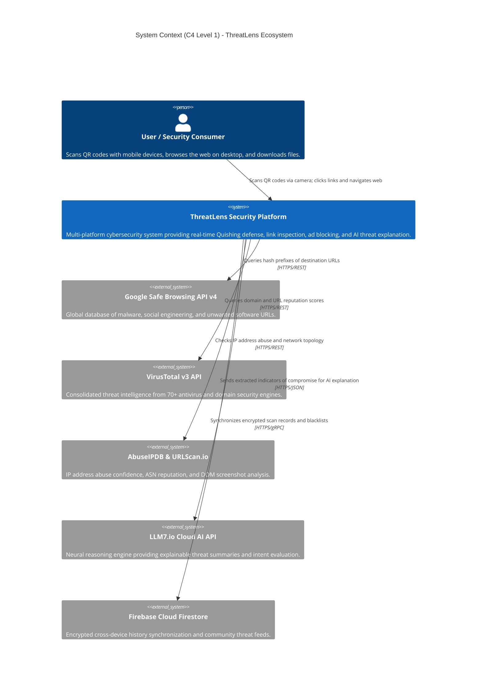
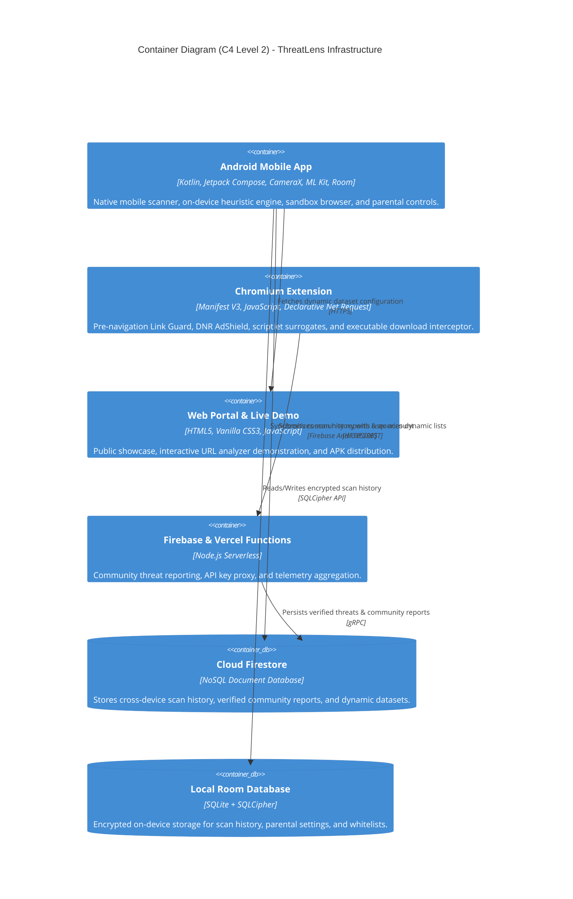
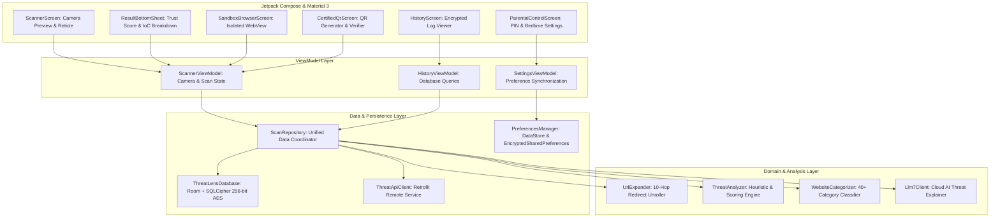
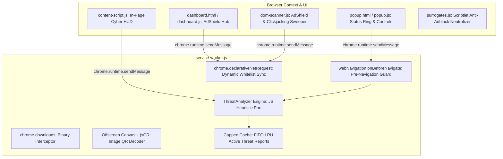
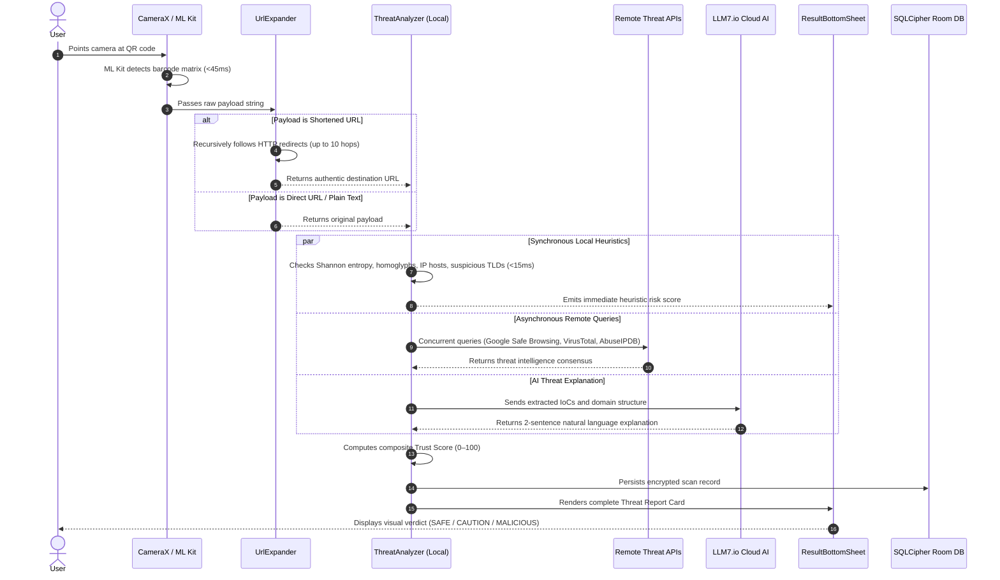
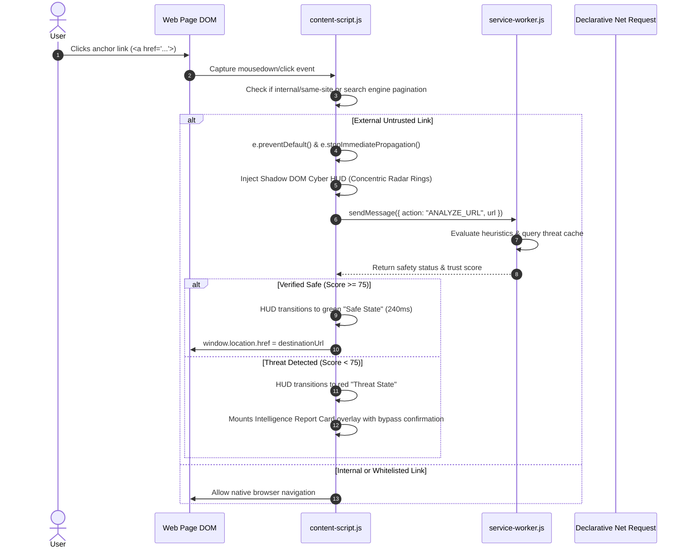
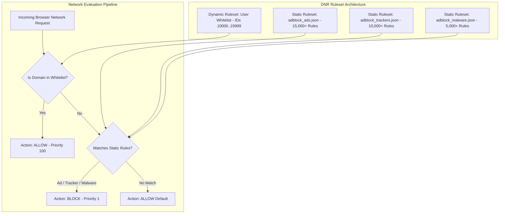

# 🏗️ THREATLENS: Deep System Architecture Specification

This document provides the complete, authoritative architectural specification for the **ThreatLens** cybersecurity ecosystem. It details the system using the **C4 Model** (Context, Containers, Components, Code), sequence diagrams, state machines, and isolation matrices across both the Android application and the Chromium Manifest V3 browser extension.

---

## 1. Architectural Philosophy & Design Principles

1. **Defense-in-Depth**: Threat protection operates across multiple independent layers: on-device lexical heuristics, computer vision matrix validation, network-level Declarative Net Request rules, commercial threat intelligence APIs, and generative AI reasoning.
2. **Sub-Second Low Latency**: Security evaluation must not hinder user experience. Synchronous heuristics resolve in under 50ms; asynchronous remote queries complete in parallel with aggressive timeouts (under 750ms).
3. **Offline Resilience**: The core detection engine functions reliably without internet access using compiled regex patterns, offline heuristic tables, and local Room database caching.
4. **Zero-Trust Destination Inspection**: The QR code or link is treated as an untrusted carrier; only the fully expanded, unrolled destination endpoint is evaluated.
5. **Privacy by Design**: No browsing history or raw scan content is transmitted without explicit user action. Telemetry is anonymized and local databases are encrypted with 256-bit AES via SQLCipher.

---

## 2. C4 Architectural Blueprint

### 2.1 Level 1: System Context Diagram



### 2.2 Level 2: Container Architecture Diagram



### 2.3 Level 3: Component Breakdown Diagrams

#### 2.3.1 Android Application Component Architecture



#### 2.3.2 Chrome Extension Component Architecture



---

## 3. Runtime Execution Lifecycle & Sequence Diagrams

### 3.1 End-to-End QR Code Scan & Threat Evaluation Flow



### 3.2 Pre-Navigation Link Guard & Cyber HUD Sequence (Browser Extension)



---

## 4. Threat Scoring Mathematical Model

ThreatLens calculates the composite **Trust Score ($T$)** on a deterministic scale of $0$ to $100$:

$$T = \max\left(0, \min\left(100, 100 - \sum P_{\text{heuristic}} - \sum P_{\text{api}} + B_{\text{trust}}\right)\right)$$

### 4.1 Heuristic Penalty Matrix ($\sum P_{\text{heuristic}}$)

| Indicator of Compromise (IoC) | Penalty ($P$) | Trigger Condition |
| :--- | :---: | :--- |
| **Homoglyph / Punycode Lookalike** | $80$ | Domain contains Cyrillic/Greek characters or begins with `xn--`. |
| **Direct IP Host Address** | $65$ | Hostname matches IPv4 pattern `^(\d{1,3}\.){3}\d{1,3}$`. |
| **Authority Section Phishing** | $80$ | URL contains `@` before hostname (credential harvesting trick). |
| **High-Risk Executable Extension** | $90$ | URL path ends with `.exe`, `.scr`, `.bat`, `.vbs`, `.iso`, `.apk`. |
| **High Shannon Entropy ($H > 4.2$)** | $30$ | Calculated domain character entropy indicates DGA generation. |
| **Excessive Subdomain Depth** | $25$ | Hostname contains $>3$ subdomain levels (e.g., `a.b.c.d.evil.com`). |
| **High-Risk TLD Abuse** | $40$ | Domain ends in `.xyz`, `.top`, `.pw`, `.buzz`, `.gripe`, `.bet`, `.lol`. |
| **Brand Spoofing Keyword** | $50$ | Known brand (e.g., `paypal`, `google`) present in non-official domain. |

### 4.2 API Penalty Matrix ($\sum P_{\text{api}}$)

| Threat API Feed | Penalty ($P$) | Trigger Condition |
| :--- | :---: | :--- |
| **Google Safe Browsing v4** | $100$ | Match found in `MALWARE`, `SOCIAL_ENGINEERING`, or `UNWANTED_SOFTWARE`. |
| **VirusTotal Consensus** | $20 \times N$ | Flagged by $N$ independent antivirus engines (capped at $100$). |
| **AbuseIPDB Abuse Score** | $\text{Score} \times 0.8$ | Confidence score $> 25\%$ reported by abuse community. |
| **URLhaus Malware Feed** | $100$ | URL or host listed in active payload distribution database. |

### 4.3 Trust Bonus Matrix ($B_{\text{trust}}$)

| Trust Signal | Bonus ($B$) | Condition |
| :--- | :---: | :--- |
| **Verified Top 1M Alexa/Tranco** | $+10$ | Domain verified in global top authority rankings. |
| **Valid Extended Validation SSL** | $+5$ | Certificate issued by trusted root CA with high-grade TLS 1.3 cipher. |
| **Domain Registration Age $> 2$ Years** | $+5$ | Domain registered $> 730$ days ago with stable DNS history. |

### 4.4 Verdict Thresholds

```
   0                     50                    80                   100
   ┌─────────────────────┬─────────────────────┬──────────────────────┐
   │   🔴 MALICIOUS      │    🟡 CAUTION       │      🟢 SAFE         │
   │  Access Blocked     │   Warning Dialog    │   Direct Access      │
   └─────────────────────┴─────────────────────┴──────────────────────┘
```

---

## 5. Sandbox Browser Security & Isolation Matrix

The Android `SandboxBrowserScreen.kt` provides an isolated runtime environment for inspecting suspicious web destinations:

| Security Attribute | Standard Chrome / WebView | ThreatLens Isolated Sandbox | Security Benefit |
| :--- | :--- | :--- | :--- |
| **Cookie Persistence** | Enabled (Persistent across sessions) | **Disabled** (`CookieManager.removeAllCookies()`) | Prevents session hijacking and persistent tracking across sites. |
| **DOM Storage (localStorage)** | Enabled | **Disabled** (`domStorageEnabled = false`) | Blocks persistent client-side identifier storage. |
| **Cache & Form Autofill** | Enabled | **Disabled** (No cache, no saved passwords) | Prevents credential leaks from spoofed input fields. |
| **Pop-up Windows** | Allowed with permission | **Blocked** (`onCreateWindow` returns false) | Eliminates malicious pop-unders and deceptive overlays. |
| **Ad & Tracker Network Requests**| Allowed | **Intercepted with HTTP 204** | Saves bandwidth, neutralizes pixel trackers, and speeds page load. |
| **Child Lock / Bedtime Lock** | None | **Enforced** (PIN-protected schedules) | Protects younger users from inappropriate content and late-night usage. |

---

## 6. Declarative Net Request (DNR) Architecture

ThreatLens implements native Manifest V3 network filtering using `chrome.declarativeNetRequest`:



### 6.1 Scriptlet Surrogates (`surrogates.js`)
To prevent websites from detecting ad-blockers and showing anti-adblock paywalls or disabling functionality, ThreatLens injects zero-overhead scriptlet surrogates in the main world:
- **`window.adsbygoogle`**: Stubs Google AdSense with a dummy push handler and `loaded = true`.
- **`window.ga` & `window.gtag`**: Stubs Google Analytics with no-op functions.
- **`window.googletag`**: Stubs Google Publisher Tag (GPT) / DFP with mock slot definitions and empty queue executors.
- **`window.canRunAds` & `window.isAdBlockActive`**: Forces anti-adblock detection variables to report that ads are running normally.

---

## 7. Fault Tolerance & Memory Management

1. **Service Worker Lifetime & FIFO Eviction**:
   - MV3 service workers can be terminated by Chrome when idle. ThreatLens stores essential settings in `chrome.storage.local`.
   - In-memory data structures (`activeThreatReports` and `notifiedDownloads`) are wrapped in bounded `CappedMap` and `CappedSet` structures capped at 100 entries to prevent memory leaks during long-running sessions.
2. **MutationObserver Throttling**:
   - `dom-scanner.js` employs a 200ms `requestAnimationFrame` debounce to prevent forced reflows and frame drops on heavy single-page applications.
3. **Safe Interception Error Boundaries**:
   - All network intercepts, image decoders, and API queries are wrapped in strict `try/catch` blocks with deterministic fallbacks, ensuring that an API outage never locks up the user's browser.
